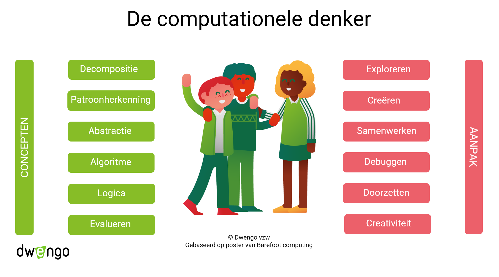

# Concepten en vaardigheden

  
Deze poster is gebaseerd op een poster van *Barefoot Computing* uit het Verenigd Koninkrijk. 

Op de poster zie je de concepten van computationeel denken en de bijhorende vaardigheden. Over de vier basisconcepten 'decompositie, patroonherkenning, abstractie en algortime' is er internationaal een consensus. Welke andere concepten en de praktijken men aanhaalt, durft nogal eens verschillen afhankelijk van wie het is, van de opleiding van die persoon en waarvoor die computationeel denken gebruikt. 
