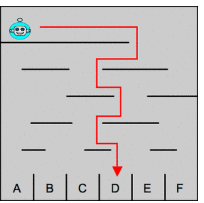
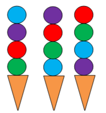
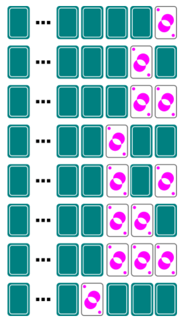

# Basisconcepten computationeel denken in de Bebras-wedstrijd

Het hoofddoel van de Bebras-wedstrijd is de deelnemers warm maken voor de informatica. Tijdens de wedstrijd pakken de deelnemers verschillende problemen aan die kunnen gelinkt worden aan concepten uit de informaticawetenschappen, en wordt dus ook het computationeel en probleemoplossend denken van de deelnemers getest.

> Voor meer uitleg over de internationale Bebras-wedstrijd zie https://www.bebras.be/nl/home

Hieronder vind je een aantal vragen uit de Bebras-wedstrijd met daarbij telkens een beschrijving van welke vormen van computationeel denken je gebruikt om *tot de oplossing te komen van de vraag*.

## Voorbeeld 1:  Decompositie en abstractie
Bron: Bebras ...

#### Groter en kleiner

De jonge bevers Anna, Britt, Charlotte, Demi en Emma - allemaal met een verschillende lengte - willen met jou een spelletje spelen. Ze plaatsen zich in een rij, de ene achter de andere, terwijl ze allemaal in dezelfde richting kijken, in een volgorde die ze zelf hebben gekozen. Elke bever telt dan hoeveel bevers vóór en achter haar groter zijn. Dit zijn de resultaten:

*In welke volgorde staan de bevers opgesteld?*

##### Oplossing

Er zijn 5 bevers.  
Uit de tabel kan je afleiden dat Demi de grootste is want geen enkel bever ervoor of erachter is groter. Daarna volgt Charlotte met slechts één bever die groter is (nl. Demi), dan Emma, en dan Anna en tot slot Britt. Britt is de kleinste bever want allee vier de andere bevers zijn groter.

Redeneer nu op de volgende manier: 
- Omdat iedereen kleiner is dan Demi, is Demi groter dan Charlotte, en moet het Demi zijn die voor Charlotte in de rij staat.   
    - Demi - Charlotte
- Er zijn twee bevers groter dan Emma en die staan voor Emma. Die twee bevers zijn Demi en Charlotte  
    - Demi - Charlotte - Emma
- Omdat slechts een groter bever voor Anna staat, met dat Demi zijn. Dus Anna komt na Demi en voor Charlotte en Emma. 
    - Demi - Anna - Charlotte - Emma
Britt heeft drie grotere bevers voor zich staan, dus staat Britt na Charlotte in de rij. 
    - Demi - Anna - Charlotte - Britt - Emma

##### Bespreking
Dit is een mooi voorbeeld van decompositie. In een eerste stap bepaal je voor elke bever hoeveel bevers kleiner zijn dan die bever en dus eigenlijk wat de rangschikking in grootte van de bevers is, en daarna gebruik je deze informatie om in een tweede stap de volgorde van de bevers in de rij te bepalen. 

In de eerste stap maak je bovendien een abstractie van het verschil tussen ‘ervoor’ en ‘erachter’. Je bent enkel geïnteresseerd in het aantal bevers die groter zijn dan een bepaalde bever, niet of die ervoor of erachter staan.

Bij de oplossing pak je de deelproblemen een voor een aan. Op die manier bekom je telkens tussenresultaten die je dan gebruikt om een volgend deelprobleem op te lossen.

## Voorbeeld 2:  Algoritme toepassen
Bron: Bebras ...

#### Naar beneden
Mevrouw Bever heeft een robot geplaatst bovenaan een doolhof. De robot daalt het doolhof af van het ene platform naar het andere eronder, totdat hij één van de vakken bereikt helemaal onderaan. Hiebij verplaatst hij zich altijd op dezelfde manier: hij verplaatst zich eerst naar rechts, en telkens wanneer hij een platform naar beneden valt, vertrekt hij opnieuw in de omgekeerde richting.

De linker afbeelding hieronder toont het traject dat de robot zal volgen in het doolhof nr. 1.

*Als mevrouw Bever haar robot helemaal links plaatst in doolhof nr. 2, in welk vak zal de robot dan uiteindelijk vallen?*

##### Oplossing

##### Bespreking
Je vindt de oplossing door het **algoritme** uit te voeren dat is opgegeven.

De robot verplaatst zich volgens een algoritme dat je moest begrijpen en toepassen op het tweede doolhof.  
Het algoritme kan als volgt beschreven worden: 

Herhaal de volgende vier lijnen, zolang je niet beneden bent aangekomen: 
&nbsp;&nbsp;&nbsp;&nbsp;Ga verder in de huidige richting, en daarna 
&nbsp;&nbsp;&nbsp;&nbsp;&nbsp;&nbsp;&nbsp;&nbsp;Val naar beneden tot aan het eerstvolgende platform, en 
&nbsp;&nbsp;&nbsp;&nbsp;&nbsp;&nbsp;&nbsp;&nbsp;Keer de huidige richting om

## Voorbeeld 3:  Patroon herkennen
Bron: Bebras ...

#### IJsjesmachine

Een ijsmachine produceert gekleurde bollen op een bijzondere systematische manier. Voor elk hoorntje worden er vier bollen geschept. Hieronder zie je hoe de laatste drie ijsjes eruit zagen die door de machine werden gemaakt:

*Hoe ziet het volgende ijsje eruit dat door de machine wordt gemaakt?*

##### Oplossing

##### Bespreking
In deze opgave wordt er expliciet gevraagd om een patroon te herkennen en te extrapoleren. Deze opgave is bedoeld voor heel jonge kinderen en is dus voor iedereen gemakkelijke te begrijpen.

De ijsmachine produceert bollen in vier verschillende kleuren, in een vaste volgorde die zich steeds opnieuw terugkeert. Na vier bollen wordt een kleur bovendien herhaald. Dus de onderste bol van een ijsje heeft altijd dezelfde kleur als de bovenste bol van het vorige ijsje.

De kleuren van de bollen bij de laatste drie ijsjes waren de volgende: 
groen - rood - paars - blauw - blauw - groen - rood - paars - paars - blauw - groen - rood 
Dus de volgorde 'groen - rood - paars - blauw' wordt steeds herhaald en loopt door van het ene ijsje naar het andere. 

Het volgende ijsje moet dus eerst een rode bol krijgen en daarna 'paars - blauw - groen'.

## Voorbeeld 4:  Algoritme toepassen en patroon herkennen
Bron: Bebras ...

#### Kaarten omdraaien
We spelen het volgende 'spelletje'. Voor je ligt een rij kaarten. Een kaart ligt ofwel met de prent naar boven of met de prent naar onder.

Één stap in het 'spel' gebeurt op de volgende manier: 
Je bekijkt de kaarten van rechts naar links. 
Als de huidige kaart met de prent naar beneden ligt, dan draai je de kaart met de prent naar boven en je stopt. 
Als de huidige kaart met de prent naar boven ligt, dan draai je ze met de prent naar onder en je gaat verder met de kaart links ervan. 
Ben je alle kaarten gepasseerd, dan stop je.

De afbeelding hieronder toont je het effect van opeenvolgende stappen: je draait eerst de kaart helemaal rechts om, dan de kaart links ervan en dan de kaart links daarvan. En dan moet je stoppen, want de derde kaart ligt nu met de prent naar boven.

Het spel start met 32 kaarten met alle prent naar beneden:

*Hoeveel kaarten liggen met de prent **naar boven** nadat je precies 32 stappen in het spel hebt gedaan? (Antwoord met een getal.)*

##### Oplossing

Na 32 stappen ligt er 1 kaart met de prent naar boven. 

##### Bespreking
Behalve het feit dat je hier een algoritme moet uitvoeren, is hier ook sprake van patroonherkenning. Tijdens het uitvoeren van het algoritme moet je merken dat er precies één kaart met de prent naar boven ligt na 1 stap, na 2 stappen, na 4 stappen, en dan telkens na het dubbel aantal stappen als de keer ervoor. Het aantal stappen is dus steeds een macht van 2. 32 is 2 tot de vijfde, dus ook dan ligt er één kaart met de prent naar boven. 

Binnenin een computer worden getallen voorgesteld in zogenaamde binaire notatie: een getal wordt 'geschreven' met enkel enen en nullen (bits genoemd). 
Bv. 1 wordt voorgesteld als 0...00001, 2 als 0...00010, 3 als 0...00011, 4 als 0...00100, 5 als 0...00101, 6 als 0...00110, enz. (Moderne computers gebruiken vaak 32 bits om een getal voor te stellen.) 
Herken je deze patronen? Wanneer je voor bit 0 een kaart met de prent naar beneden legt, en voor bit 1 met de prent naar boven, dan krijg je dezelfde patronen als bij de eerste 6 stappen van ons spel. Als je weet dat de binaire voorstelling van 32 niets anders dan 0...01000000 is, dan zie je dat er na 32 stappen precies één kaart met de prent naar boven ligt. 
Wat we in deze puzzel een 'stap' noemen, is wat er door de elektronica van een computer gebruikt wordt om een binair getal met 1 te verhogen.

## Voorbeeld 5:  Algoritme bedenken
Bron: Bebras ...

#### Korste route

De kleine bever speelt graag in het park. Zijn huis (H) en het park (P) zijn met elkaar verbonden door bruggen, gemaakt van boomstammen van dezelfde lengte, zoals je ziet op de kaart hieronder:

Er zijn echter enkele plaatsen op de kaart, aangeduid met een rode X, waar hij niet voorbij kan.

*Hoeveel verschillende routes van het huis naar het park kan hij volgen met dezelfde minimale lengte?*

##### Oplossing

Het aantal mogelijke routes tot aan een bepaald kruispunt is de som van het aantal routes dat van links komt en het aantal dat van beneden komt. (Je mag niet van rechts of van boven komen, want dan moet je ooit terugkeren en dan is het pad niet van minimale lengte.)
Daarom noteer je vanaf links onderaan bij elk kruispunt de aantallen op en verplaats je je stap voor stap naar rechts en naar boven. Het getal dat je dan rechtsboven opschrijft, is het uiteindelijke antwoord.

##### Bespreking

Je moet op voorhand een systematische manier bedenken om tot die oplossing te komen (= een algoritme opstellen). Bij dit voorbeeld: van linksonder naar rechtsboven te werken en telkens bij de boomstammen op te schrijven hoeveel wegen ernaartoe leiden.

Merk op dat je hier wel algoritmische denken nodig hebt, maar niet hoeft te programmeren!

Als je bekend bent met bestaande algoritmes voor korste route dan kan je die toepassen.

## Voorbeeld 6:  Abstractie maken
Bron: Bebras ...

#### Stormbestendig netwerk 

De GSM-maatschappij Bever Telecom wil GSM-masten plaatsen op Windeneiland.
Het dekkingsgebied van een mast is een cirkel die errond is gecentreerd. Twee masten heten verbonden met elkaar als hun dekkingsgebieden overlappen. Twee masten kunnen met elkaar communiceren als er een rij tussenliggende masten bestaat zodat elke mast met elke volgende is verbonden.
Door de sterke wind op het eiland gebeurt het af en toe dat een mast breekt. Als er ergens één mast niet meer functioneert, willen we toch nog dat elke twee van de overblijvende torens met elkaar kunnen blijven communiceren.
Welke van de opstellingen hieronder moeten we hiervoor gebruiken?

##### Oplossing

Het juiste antwoord is B. 

##### Bespreking

Om gemakkelijk tot een oplossing te komen, voer je naast de abstractie die er al is nog een bijkomende abstractie toe: je verbindt twee masten met elkaar wanneer de overeenkomstige cirkels overlappen, en je verwijdert de cirkels. Dit is een cruciaal deel van het oplossingsproces.

