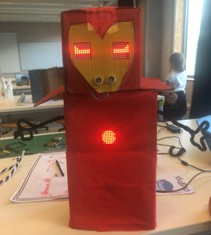

# Ontwerp en realiseer een sociale robot
In het project 'Sociale robot' maken de leerlingen een schets van hun droomrobot. Ze bedenken hoe hun robot zal communiceren met mensen, en ze beschrijven dit met een algoritme. Ze schrijven neer welke sensoren en actuatoren daarvoor nodig zijn.  Nadien passen ze het ontwerp aan op basis van (zelf) opgelegde criteria en de beperkingen van de sensoren en actuatoren in de bouwkit waar ze over beschikken.  
Tot slot creëren ze een fysieke robot, gebaseerd op hun eigen ontwerp. 

**Doelgroep**: 1ste of 2de graad - alle finaliteiten; 3de graad - finaliteit arbeidsmarkt; alle graden OKAN

**Vak**: 1ste graad Techniek - STEM - Informatica; 2de graad STEM - Informatica; 3de graad PAV - STEM

### Uitdaging: Ontwerp je droomrobot en maak er een schets van. Geef weer hoe deze sociale robot met mensen communiceert.

### Stap 2: De leerlingen passen het ontwerp aan op basis van (zelf) opgelegde criteria en de beperkingen van de sensoren en actuatoren in de bouwkit waar ze over beschikken. (De criteria kunnen zelf opgelegd zijn en/of opgelegd door de leerkracht.)

### Stap 3: De leerlingen realiseren de robot op basis van het ontwerp eerst in de simulator en nadien als fysieke robot.

### Stap 4: De leerlingen detecteren bepaalde patronen en passen abstractie toe.

### Concreet: De leerlingen implementeren gewenste acties in de simulator.

### Concreet: De leerlingen monteren de hardware op het lichaam van de robot.

### Eindtermen 1ste graad (Bron: onderwijsdoelen.be)

Digitale competentie en mediawijsheid: 4.1, 4.3, 4.4, 4.5; BG 4.1, BG 4.3, BG 4.4. 
Leercompetenties: 13.1, 13.4, 13.8, 13.12, 13.14, 13.18; BG 13.4. 
Techniek: ...
