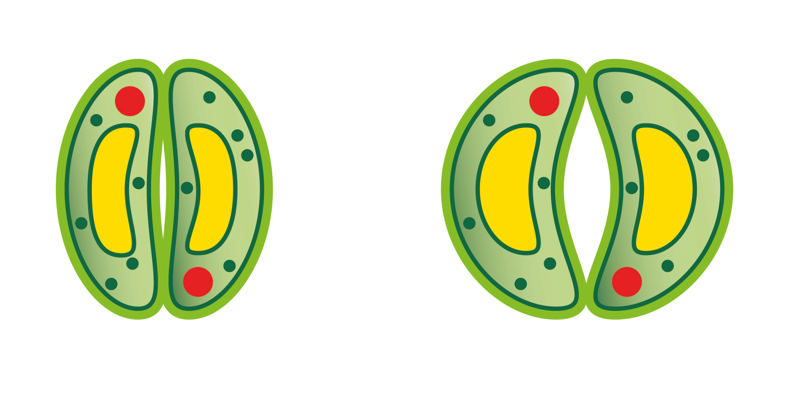
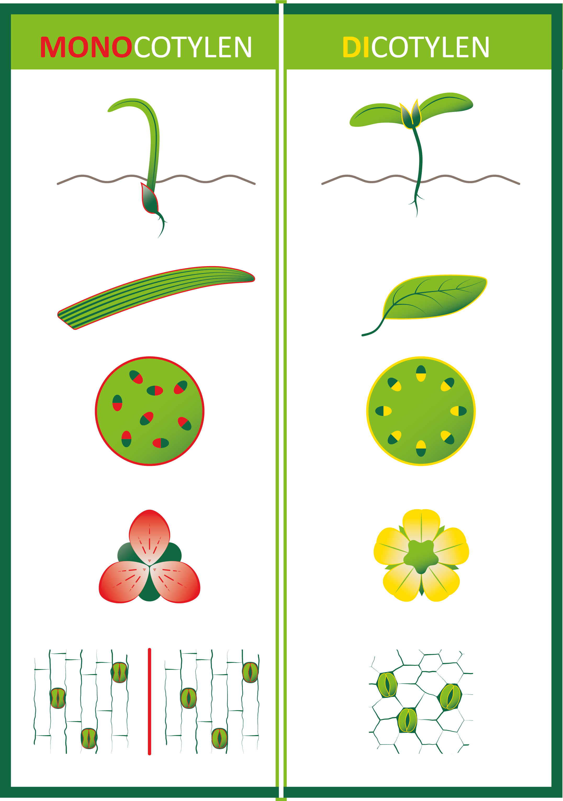

# Monocotylen en dicotylen 

<figure>
    <figcaption align = "center">Figuur 1: Bladstructuur (Zephyris, 2011)</figcaption>
</figure>

Een huidmondje ligt tussen twee sluitcellen (zoals te zien op de bladstructuur in Figuur 1). Als de sluitcellen in volume toenemen, gaat het huidmondje open. De sluitcellen nemen in volume toe door het opnemen van water. Het gevolg is dat de sluitcellen krommen, waardoor het huidmondje opent (Zie Figuur 2).

<figure>
    <figcaption align = "center">Figuur 2: Gesloten en open huidmondje</figcaption>
</figure>

**Stomata kunnen op beide zijden van een blad voorkomen (amphistomateus), of op slechts één zijde, meestal de onderkant (hypostomateus), uitzonderlijk de bovenkant (epistomateus), bv. bij een waterlelie.** 
De stomata en de cuticula worden gezien als **sleutelelementen in de evolutie van planten**. Ze zorgen ervoor dat planten in verschillende en wisselende omstandigheden kunnen leven zonder uit te drogen (Hetherington & Woodward, 2003). 

Stomata geven informatie over de plaats van de plant in de stamboom van de bloemplanten. Onder de bedektzadigen of bloeiende planten onderscheidt men de **dicotylen** en de **monocotylen** (zie Figuur 3). De stomata van dicotylen zijn niervormig, terwijl die van monocotylen niervormig of haltervormig kunnen zijn, afhankelijk van de plant. De nerven van monocotylen liggen evenwijdig en hun huidmondjes ook. De nerven van dicotylen zijn vertakt en hun huidmondjes liggen willekeurig verspreid over het blad.

<figure>
    <figcaption align = "center">Figuur 3: Monocotylen en dicotylen</figcaption>
</figure>

    <strong>Notebook Datatypes voor opsommingen</strong> 
    Op de webpagina https://dwengo.org/python/ vind je het leerpad <em>Datatypes</em>. In de notebook <em>1000_Opsommingen.ipynb</em> van dit leerpad komen monocotylen en dicotylen aan bod.

 

<strong>Video</strong> 

[Stomatal Closure in Tradescantia Leaf Cells.](https://youtu.be/AwyrqfNTuxQ "davcjal, 2015")  
[Monocot and Eudicot Germination Time-lapse.](https://youtu.be/WbG5zu2Vw0I "Sci- Inspi, 2018")

