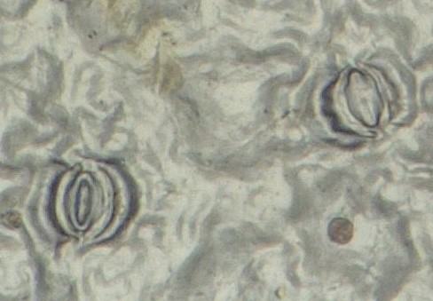

# Openen en sluiten van stomata 

Een plant zoekt voortdurend naar een evenwicht tussen vochtverlies en CO2-opname, afhankelijk van de vochttoestand van de plant, luchtvochtigheid, licht en CO2-concentratie. Al deze factoren samen met de biologische klok van de plant bepalen of en in welke mate de huidmondjes openstaan. 

Stomata zijn onderhevig aan ritmes zoals dag en nacht en de seizoenen. 

Duidelijk is dat de stomata ‘reageren’ op **omgevingsfactoren**. Bij eenzelfde plant ziet men soms het verschil tussen bladeren onderaan de plant, die veel beschaduwd zijn, en bladeren in de kruin die veel meer blootgesteld zijn aan het licht. Zelfs op eenzelfde blad kunnen stomata zich anders gedragen omdat dit de plant ten goede kan komen; op eenzelfde blad kunnen sommige stomata open zijn en andere gesloten (Zie Figuur). 

 
<figure>
    <figcaption align = "center">Figuur: Open en gesloten stoma op zelfde blad.</figcaption>
</figure> 
