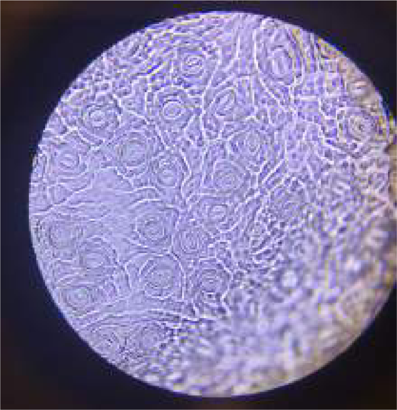
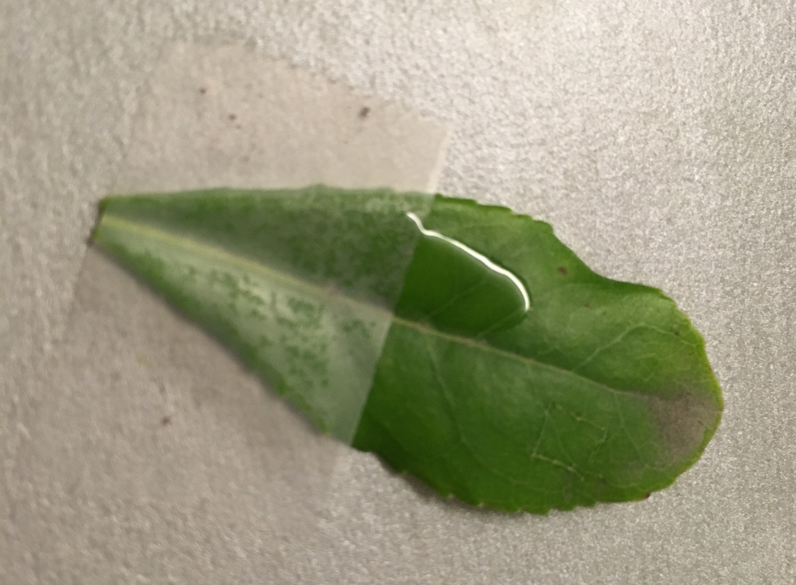

# Microscopie 

Niemand heeft reeds huidmondjes gezien met het blote oog. Je kan huidmondjes bewonderen met een **microscoop**. Dat is een toffe ervaring want je kan de huidmondjes ook door de microscoop **fotograferen** met een smartphone. Je kan bv. een monoculaire microscoop gebruiken die 400 keer vergroot.  
Als je door de microscoop naar **levend** materiaal kijkt, dan krijg je mooie beelden te zien (Zie Figuur 1). Daarvoor moet je er wel in slagen een stuk van de flinterdunne cuticula van het blad te verwijderen. Bij sommige planten lukt dat niet zo goed, bv. door de stugheid van het blad. 

 
<figure>
    <figcaption align = "center">Figuur 1: Microfoto van levend materiaal.</figcaption>
</figure> 

Je kan dit opvangen door dezelfde methode te gebruiken als de onderzoekers van de Plantentuin Meise, nl. een **afdruk** nemen van het blad met doorzichtige nagellak (Figuur 2). 

 
<figure>
    <figcaption align = "center">Figuur 2: Bladafdruk nemen met nagellak en plakband.</figcaption>
</figure> 

<iframe width="1848" height="799" src="https://www.youtube.com/embed/JptF3jhOV5k" title="KIKS - Nagellakafdruk" frameborder="0" allow="accelerometer; autoplay; clipboard-write; encrypted-media; gyroscope; picture-in-picture" allowfullscreen></iframe>

De foto’s zijn dan niet meer zo mooi van kleur, maar grijsachtig (zie Figuur 3). Maar al bij al levert het nog steeds mooie plaatjes op; de natuur op zijn best. 

<figure>
    <figcaption align = "center">Figuur 3: Microfoto van levend materiaal.</figcaption>
</figure> 

Door de planten gevarieerd te kiezen, krijg je ook een **variatie** in de beelden: monocotylen en dicotylen, grote en kleine huidmondjes, stomata van verschillende vormen ... 

***A.d.h.v. een practicum kan je de vorm en de ligging van huidmondjes bij monocotylen en dicotylen verifiëren.*** 
***Je kan a.d.h.v. een practicum ook het effect van zon en schaduw onderzoeken. Formuleer hierbij een onderzoeksvraag en een hypothese. Na het practicum koppel je terug naar de hypothese.***  
***Je kan a.d.h.v. een practicum ook het effect van de seizoenen onderzoeken. Formuleer hierbij een onderzoeksvraag en een hypothese. Na het practicum koppel je terug naar de hypothese.*** 

    <strong>Practicum - microscopie (huidmondjes)</strong> 
    <ul><li>Verzamel volgroeide bladeren van planten met parallelle nerven en van planten met niet-parallelle nerven.</li></ul> 
    <ul><li>Neem eventueel bladeren die veel licht krijgen en bladeren onderaan de plant, bladeren van een struik in de zon en van eenzelfde struik in de schaduw.</li></ul> 
    <ul><li>Probeer met een mesje een deel van de flinterdunne cuticula te verwijderen. Breng het aan op een glaasje met een druppel water en dek af met een afdekglaasje.</li></ul> 
    <ul><li>Lukt het niet door de textuur van het blad, neem dan een nagellakafdruk van het blad. Breng de afdruk met plakband aan op een glaasje.</li></ul> 
    <ul><li>Noteer of je de onderkant of de bovenkant van het blad hebt gebruikt.</li></ul> 
    <ul><li>Noteer wanneer en waar je het blad geplukt hebt: seizoen, zon, schaduw ...</li></ul> 
    <ul><li>Noteer de naam van de plant.</li></ul> 
    <ul><li>Noteer of het een monocotyl of dicotyl is.</li></ul> 
    <ul><li>Bekijk het preparaat onder de microscoop.</li></ul> 
    <ul><li>Noteer wat je ziet: veel of weinig huidmondjes, grote of kleine huidmondjes, welke vorm ze hebben, hoe ze geordend zijn ...</li></ul> 

 
