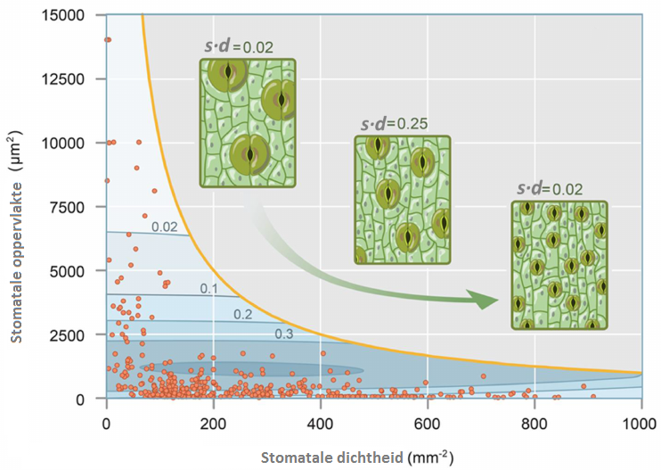
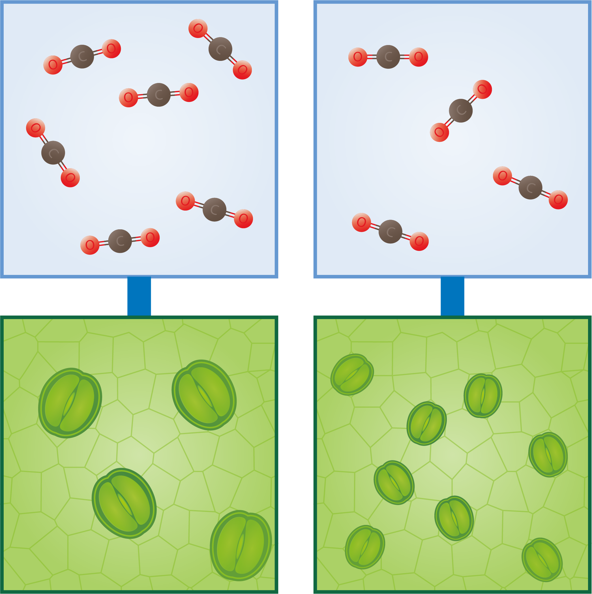

# Evolutie van planten en hun stomata 
**Fossiele bladeren geven veel informatie over de evolutie van planten en hun stomata.** Vierhonderd miljoen jaar geleden kwamen stomata bij planten voor het eerst voor. Sindsdien zijn ze geëvolueerd: er zijn opvallende veranderingen opgetreden waaronder verschillen in de grootte en de dichtheid van de stomata (zie Figuur 1) (Hetherington & Woodward, 2003). **Veel planten zijn op zo’n manier geëvolueerd dat de door stomata ingenomen bladoppervlakte (s.d) zo klein mogelijk is** (Assouline & Or, 2013; Franks & Beerling, 2009). 

 
<figure>
    <figcaption align = "center">Figuur 1: Fossil record-based plant leaf stomatal size (<em>s</em>) and density (<em>d</em>). Hoe meer stomata per oppervlakte-eenheid, hoe kleiner de stomata. De planten zijn zo geevolueerd dat de ingenomen bladoppervlakte (<em>s.d</em>) zo klein mogelijk is (Assouline & Or, 2013). Gebaseerd op Franks & Beerling, 2009.</figcaption>
</figure> 

**Bij een lage CO2-concentratie zijn planten met veel stomata in het voordeel en komen ze dan ook veel voor. Wanneer er veel CO2 in de atmosfeer zit, zijn planten met minder stomata in het voordeel en zullen veel voorkomen** (Thanukos, 2018). Dit wordt geïllustreerd in Figuur 2. 

 
<figure>
    <figcaption align = "center">Figuur 2: Verband tussen aantal en grootte van de stomata en de CO2-concentratie.</figcaption>
</figure> 

**Uit fossiel plantenmateriaal blijkt dat planten reageren op langdurige verandering in CO2 via een aanpassing in de dichtheid van de stomata.** Behalve de fotosynthese, zijn ook de transpiratie en de waterhuishouding van de planten factoren die daarin meespelen (Franks & Beerling, 2009; de Boer et al., 2016). 

**De hoeveelheid CO2 in de atmosfeer kan daarom afgeleid worden uit de stomatale dichtheid. Aangezien het CO2-niveau een direct effect heeft op globale temperaturen, geven veranderingen in het CO2-niveau ook een duidelijk beeld van veranderingen in het klimaat.** (Assouline & Or, 2013; Franks & Beerling, 2009). 

<strong>C3, C4 en CAM (facultatief)</strong> 

De evolutie in het plantenrijk heeft geresulteerd in drie soorten planten: C3-, C4- en CAM-planten. Voor elke soort verloopt de fotosynthese anders. In warme gebieden hebben C3-planten de neiging tot respiratie ten nadele van fotosynthese. C4- en CAM-planten hebben het fotosyntheseproces aangepast om dit tegen te gaan.  Ongeveer 85 % van de plantensoorten zijn C3-planten, zoals granen en groenten (bv. rijst, graan, spinazie, tomaten) en alle bomen (bv. appelbomen, eik). Ze vormen moleculen met 3 C-atomen tijdens het fotosyntheseproces.  Ongeveer 5 % van de plantensoorten zijn C4-planten, zoals maïs, gierst, suikerriet en vele grassen. Ze maken wel 25 % uit van de planten op aarde en komen vooral voor in tropische, vaak droge gebieden. Ze vormen moleculen met 4 C-atomen tijdens het fotosyntheseproces.  De overige 10 % van de plantensoorten zijn CAM-planten, zoals cactus, ananas, Kalanchoë en sedum. Ze komen vooral voor in droge gebieden met hoge dagtemperaturen en lage nachttemperaturen. Ze vormen ook moleculen met 4 C-atomen tijdens het fotosyntheseproces, maar ze verschillen van de C4-planten omdat ze ‘s nachts hun stomata openen om CO2 op te nemen. Zo beschermen ze zichzelf tegen uitdroging. Die CO2 wordt in de plant opgeslagen en gedurende de dag, als de nodige lichtenergie voorhanden is, terug beschikbaar gemaakt voor de fotosynthese. (Yamori et al., 2013; Sterrenwacht Armand Pien, 2018).

 

    <strong>Notebook Datatypes voor opsommingen</strong> 
    Op de webpagina https://dwengo.org/python/ vind je 'Opsommingen' in het leerpad <em>Datatypes</em>. In de notebook <em>1000_Opsommingen.ipynb</em> van dit leerpad komen C3-, C4- en CAM-planten aan bod.  
    Voor het KIKS-project is kennis van C3-, C4- en CAM-planten facultatief.

 
