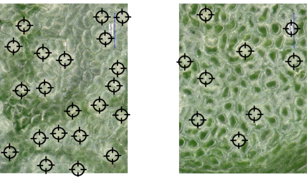

# Invloed van de omgeving op de vorming van stomata 
**Experimenten bevestigen dat dichtheid en grootte kunnen veranderen door genetische aanpassingen, alsook door veranderingen in omgevingsfactoren.** Dit betekent dat zowel tussen plantensoorten, tussen individuele exemplaren van eenzelfde soort, als tussen bladeren van eenzelfde plant verschillen kunnen optreden. Voorbeelden van verandering in omgevingsfactoren: 

<ul><li>Bij exemplaren van eenzelfde soort, maar die groeien in verschillende omstandigheden (nl. in de schaduw of in de zon) kunnen verschillen optreden in stomatale dichtheid. Bij een onderzoek op crabwood (Carapa) in het Amazonezoud was de stomatale dichtheid bij de bezonde planten groter (Camargo & Marenco, 2012).</li></ul> 

<ul><li>Bij eenzelfde plant kan het aantal stomata op beschaduwde bladeren onderaan de plant verschillen van het aantal stomata op bladeren in de kruin die veel meer blootgesteld zijn aan het licht. Sofie Meeus stelde dat vast op de Monodora angolensis in de Plantentuin Meise, zoals te zien op de figuur.</li></ul> 

 
<figure>
    <figcaption align = "center">Figuur: respectievelijk bezond en beschaduwd blad van <em>Monodora angolensis</em></figcaption>
</figure> 

<strong>Notebook - machinaal leren - classificatie (nu of later)</strong> 

<ul><li>Doorloop de notebook <em>StomataZonSchaduw.ipynb</em> in de map <em>IntroductieMachineLearning</em> tot na de animatie. Je ziet dat de planten die in de zon groeiden, gescheiden kunnen worden van de planten die in de schaduw groeiden, en dat louter gebaseerd op de afmetingen en de dichtheid van de huidmondjes. Je hoeft nog niet alles te begrijpen in deze notebook.</li></ul> 
<ul><li>Merk je op dat het neurale netwerk eerst volledig willekeurig een rechte kiest en die stap voor stap aanpast tot er een gewenste scheidingsrechte is gevonden?</li></ul>

 

<strong>Notebook (facultatief)</strong> 
<ul><li>In de notebook <em>TensorenRgb.ipynb</em> in de map <em>IntroductiePython</em> worden deze foto’s van Sofie Meeus en microfoto’s van de Plantentuin Meise gebruikt.</li></ul>

