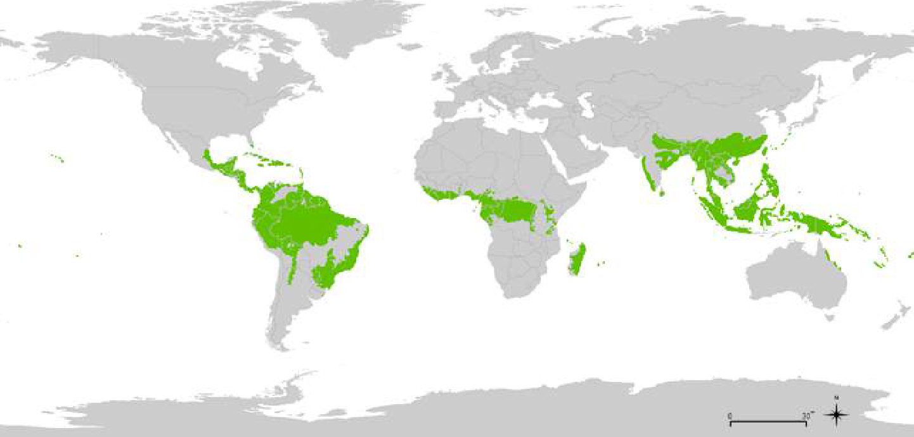

# Stomata en klimaatverandering 

**De water- en CO2-cycli van de wereld worden beïnvloed door de transpiratie van planten op het land. Men kan dus zeggen dat stomata een impact hebben die globaal is, een impact op de hele wereld. Er wordt het meest getranspireerd door de vegetatie in de warme beboste gebieden van de tropen** (zie figuur) (Hetherington & Woodward, 2003). De tropische regenwouden situeren zich in gebieden in de buurt van de evenaar. Ze bevinden zich in Centraal- en Zuid-Amerika, in Afrika, in Azië en op de eilanden rond Australië. **Het is belangrijk om te begrijpen hoe planten deze transpiratie zullen aanpassen aan de huidige klimaatverandering.** Wetenschappers onderzoeken ook hoe de huidige klimaatverandering de vorming van stomata beïnvloedt. 

 
<figure>
    <figcaption align = "center">Figuur: De tropische regenwouden zijn groen gekleurd op de kaart.</em></figcaption>
</figure> 

Een veranderend klimaat heeft een impact op de biodiversiteit en omgekeerd kan de **biodiversiteit** ook de klimaatverandering beïnvloeden. Bv. transpiratie verkoelt niet enkel de plant, maar ook haar omgeving. Er zijn grote verschillen in hoe planten reageren op de CO2-toename en in de mate waarin planten CO2 opnemen. 
Het is bv. cruciaal dat men inzicht krijgt in de aanpassingen van gewassen om de **voedselvoorziening** te kunnen bewaken. 

<strong>Video</strong> 

[Stomata and global climate cycles.](https://youtu.be/eD2J3PBoERI "Bergmann, 2015")

<strong>Samengevat</strong> 

Planten passen zich aan aan veranderende omstandigheden, zoals licht, seizoen, temperatuur, watervoorraad en de atmosferische CO2-concentratie. Via hun huidmondjes regelen ze hun waterhuishouding en zorgen ze ervoor dat ze CO2 opnemen om te groeien. 
Doorheen de evolutie hebben planten hierin een evenwicht gevonden. Hoe hoger de CO2-concentratie, hoe minder huidmondjes. Hoe groter de stomatale dichtheid, hoe kleiner de huidmondjes. Daarom kan men de dichtheid en de afmetingen van huidmondjes gebruiken als tool om het heersende klimaat waarin de planten groeiden, te reconstrueren. 

Het is belangrijk om te weten hoe snel planten zich aanpassen, om bv. te kunnen inschatten hoe de biodiversiteit en de voedselvoorziening beïnvloed zullen worden door een toenemend CO2-gehalte. Daarom is het interessant om te onderzoeken of de verandering van CO2-concentratie tijdens de voorbije 100 jaar reeds een meetbaar effect teweegbracht op de stomata van planten. 

Na dit hoofdstuk weet je wat het verband is tussen fotosynthese en stomata. 
Je weet wat monocotylen en dicotylen zijn. 
Je weet dat de CO2-concentratie en andere omgevingsfactoren een invloed hebben op de vorming van huidmondjes.

<strong>Samengevat - computerwetenschappen</strong> 

Misschien hebben functies en tensoren in Python nu geen geheimen meer voor je.

