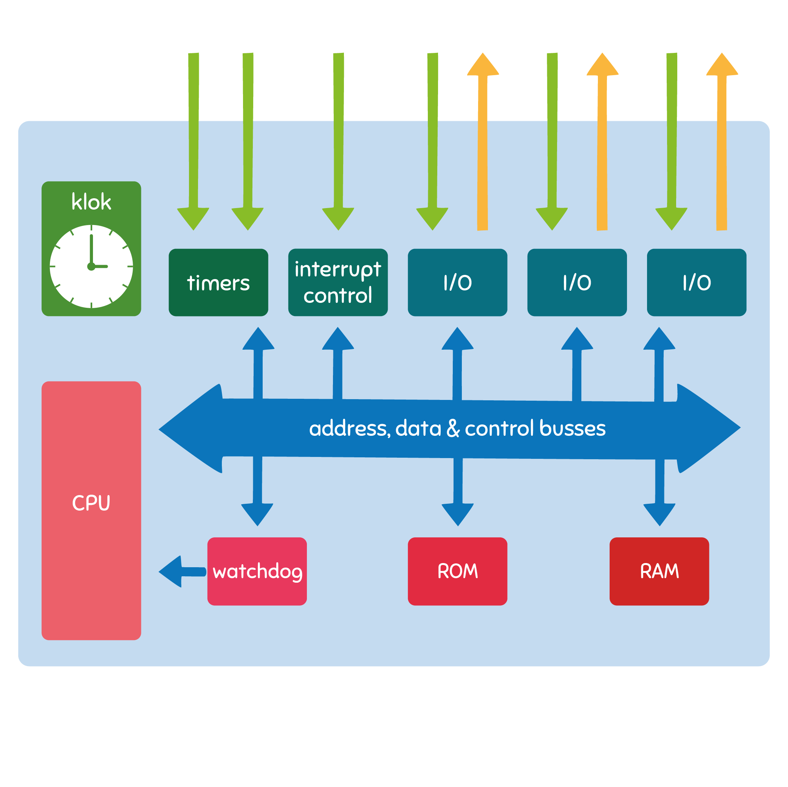

# Microcontroller

## Bouwstenen van een microcontroller

De behandelde onderdelen van de microcontroller vormen een hele boterham. Het is normaal dat dit wat overweldigend overkomt.

Op dit moment is het voldoende om te beseffen dat je in dit project code zal schrijven voor een microcontroller, en *niet* voor een klassieke computer met snelle processor en geheugen van meerdere gigabytes.

De microcontroller die je zal gebruiken, de AT90USB646, kan tot 16 miljoen instructies per seconde (MIPS) uitvoeren en is voorzien van 64 KB programmageheugen en 4 KB datageheugen. 
De microcontroller heeft bovendien een 8-bit architectuur, wat impliceert dat de registers en bus 8 bit breed zijn. Bij het schrijven van code hou je dit best in gedachten en gebruik je waar mogelijk 8-bit datatypes. 

Het optellen van twee 8-bit getallen kan in één kloktik gebeuren, terwijl het optellen van twee floating point getallen meer dan 100 kloktikken in beslag neemt!   

Aan jullie de uitdaging om deze beperkte computerkracht efficient te benutten.

