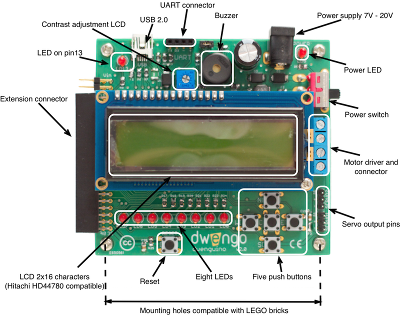

# De dwenguino

## Een kort overzicht

Het dwenguino platform is een veelzijdig microcontrollerplatform dat ontwikkeld werd door [dwengo vzw](dwengo.org "dwengo website"). Het bevat reeds een aantal componenten waaronder een lcd-scherm, leds, een buzzer, knopjes en een motordriver zodat men heel snel allerlei toepassingen kan realiseren en testen.

De dwenguino wordt gebruikt in scholen en [internationale projecten](dwengo.org/projects "Internationale projecten"), en ook gaan het gebruiken in dit project. Echter, waar de meeste leerlingen en hobbyisten de dwenguino op een toegankelijke manier programmeren in Arduino IDE of dwenguino blockly, moeten jullie de dwenguino programmeren door te steunen op de AVR-bibliotheken en de lijvige datasheet. Dit maakt het welliswaar moeilijker, maar zorgt er wel voor dat je een goed en volledig begrip zal krijgen van de werking van een microcontroller.

