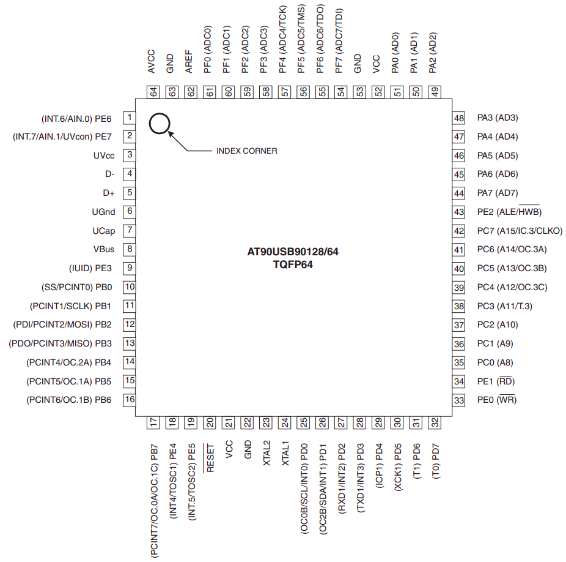

# Practicum 1

## Inleiding

In dit practicum leren jullie de basis van het microcontrollerprogrammeren. We gebruiken in dit practicum een AVR microcontroller, dit type wordt onder andere ook gebruikt voor het Arduino platform.

Als je vast komt te zitten tijdens het practicum, herbekijk zeker de video's 3 en 4 van *Operatoren* en *Tri-state logica*.

Het programmeren van de microcontroller doe je via de tekstuele optie in de simulator die jullie rechtsbovenaan deze pagina kunnen vinden. 
Eens je de simulator geopend hebt, kan je deze overschakelen naar de code-UI door linksbovenaan op de *Blockly-Code*-switch te drukken.

## De microcontroller

Voor deze oefening maken jullie gebruik van het Dwenguino bord. Dit bord bevat een **AT90USB646** microcontroller, dit is de grote vierkante chip onder het LCD scherm. Het is deze chip die jullie in het practicum zullen programmeren.   

Op onderstaande figuur zie je de pin layout van de chip. Het is via deze pinnen dat de chip communiceert met de compomenten op het Dwenguino bord, zoals de 8 leds, 5 drukknopen, een LCD scherm, een motor controller, een speaker en Arduino compatibele expansion ports. In dit practicum moeten jullie enkel communiceren met de leds op het bord.

## Oefening 1: Leds aanschakelen met de drukknoppen**

Analyseer eerst het schema van de Dwenguino om te achterhalen hoe de leds met de microcontroller verbonden zijn.

Een deel van de fysieke pinnen van de microcontroller kan je gebruiken om waarden te inputten en outputten (I/O). Het andere deel wordt voor allelei dingen gebruikt, zoals b.v.b. voeding, kloksynchronisatie en USB connectie. Zoek in de datasheet van de microcontroller in sectie 2.2 (pp. 8-10) welke pinnen gebruikt kunnen worden voor I/O.

Merk op dat de I/O pinnen steeds gegroepeerd zijn per 8.

Een **I/O-poort** is het geheel van:

* 8 fysieke pinnen (de letterlijke stukjes metaal)
* Drie 8-bit registers (DDRx, PINx, PORTx)
* 8 pull-up weerstanden
* Een aantal elektrische componenten voor de werking van de poort

Elke poort wordt in de datasheet benoemd met een x die je moet vervangen door een hoofdletter bvb A, B etc. Bij Port A horen dus registers DDRA, PINA en PORTA. Deze registers zal je in dit practicum juist moeten instellen of inlezen om de I/O poort te gebruiken. Om de 8 bits in een register te benoemen, gebruikt de dataset de letter n. n moet je dus vervangen door een getal tussen 0 en 7.

> In hoofdstuk 11 van de datasheet (p. 72) vind je schema 11-2. Dit schema toont een achtste van een I/O-poort, het stuk dat hoort bij 1 fysieke pin. Een hele poort bestaat dus uit 8 keer wat je ziet op het schema.    Het is normaal dat je momenteel nog niet veel van de figuur begrijpt. De essentie is als volgt. Helemaal links zie je Pxn staan. Pxn is de fysieke pin ("het metaaltje"). Dat metaaltje is verbonden met 3 flipflops: DDxn, PORTxn, PINxn. Een flipflop is een elektrische component die 1 bit opslaat. De DDxn bit is verbonden met een driehoekje (= een tri-state buffer) en bepaalt daarmee of de waarde van de PORTxn bit al dan niet op Pxn ge-output wordt. Daarnaast kan je zien dat Pxn ook verbonden is met de PINxn bit (de tussenliggende compomenten mag je negeren). Dit geeft je de mogelijkheid om de waarde te lezen die op de pin staat.

### Pinnen configureren als input of output

De I/O-pinnen van de microcontroller kan je configureren zodat je ze ofwel kan uitlezen, ofwel er naar kan schrijven. Dit stel je in via het DDRx-register, hierbij vervang je x door de naam van het I/O-register.

> DDR staat voor *Data Direction Register*. Het bepaalt dus de richting waarin de data gaat: ingelezen of uitgeschreven.

#### Pinnen configureren als output

Wil je bijvoorbeeld de eerste en derde en pin van Port A instellen als een output pin, dan doe je in je C code:

<pre>DDRA |= 0b00000101;

// of equivalent

DDRA |= _BV(PA0) | _BV(PA2);</pre>

_BV(NAAM_VAN_PIN) is een voorgedefinieerd macro uit de AVR bibliotheek. Een macro wordt door de C compiler voor het compileren omgezet in gewone C code. Hieronder zie je de definitie van de _BV macro:

<pre>#define _BV(bit) 1 &lt;&lt; bit</pre>

Bijgevolg is dus bijvoorbeeld:

<pre>_BV(PA2) == _BV(2) == (1 &lt;&lt; 2) == (0b00000001 &lt;&lt; 2) == 0b00000100</pre>

> DDRA, PA2 etc. zijn ook macro's die het voor ons gemakkelijker maken om de juiste registers en bits aan te passen. Dit soort macro's bestaan voor alle bits en registers die je later zal tegenkomen in de datasheet, zoals bv. de WGM10 bit in het TCCR1A register.

Merk ook op dat we de registers niet volledig overschrijven met =, maar dat we de bitwise or |= gebruiken. Dit zorgt ervoor dat we de overige bits in het register niet aantasten.

#### Pinnen configureren als input

Om dezelfde pinnen terug in te stellen als input doe je: 

<pre>DDRA &amp;= 0b11111010
// of equivalent:
DDRA &amp;= ~(_BV(PA0) | _BV(PA2))</pre>

> Tip: het _BV macro gebruiken met de naam van de pin (bv. PA2) maakt je code leesbaarder en voorkomt fouten. Dit wordt beschouwd als good practice en we raden jullie sterk aan dit ook te doen voor de practica en het project.

### Waarde outputten op een pin

Daarnet lezen we hoe we pinnen instellen als output. Nu kunnen we er een **waarde** naar schrijven aan de hand van het PORTx register. Zo kunnen we bv. de laagste bit van PORTA aanschakelen:

<pre>PORTA |= 0b00000001;</pre>

### Waarde inlezen van pinnen

Om een waarde van alle pinnen van een poort x in te lezen gebruiken we het PINx register. Op volgende manier lezen we bijvoorbeeld de 8 pinnen van Port A in:

<pre>char my_var = 0;
my_var = PINA;</pre>

Bij het configureren van de pinnen zagen jullie al hoe _BV gebruikt kan worden om bitmaskers te creëren. Om te controleren of een bepaalde bit van een register op 1 of 0 staat maak je ook gebruik van een masker. Als we bijvoorbeeld willen controleren of de vierde bit van het PINA register op 1 staat gebruiken we de volgende code:

<pre>if (PINA &amp; _BV(PA3)) {
    // Ja, de vierde bit van het PINA register staat hoog.
} else {
    // Nee, de vierde bit staat laag.
}</pre>

