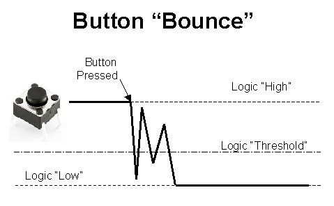

# Practicum 1

## Oefening 2: Schakelaar

### Opdracht oefening 2

Pas nu je code aan zodat je met de onderste knop de leds aan en uit kan schakelen. Zorg ervoor dat telkens je op de knop indrukt de toestand van de leds wisselt.

Test ook wat er gebeurt als je de knop ingedrukt houdt. Het is de bedoeling dat de toestand van de leds slecht eenmaal wisselt per druk, ongeacht hoe lang je de knop ingedrukt houdt.

### Button debounce

Bij het indrukken/loslaten van een drukknop wordt er een elektrische connectie gemaakt/onderbroken. In een perfecte wereld zou deze overgang onmiddellijk en eenmalig gebeuren, maar in de realiteit vertonen knoppen een "bounce" gedrag. Wanneer je een knop indrukt of loslaat, kan het zijn dat hij meerdere keren van toestand wisselt.

Dit probleem oplossen wordt "de knop debouncen" genoemd, en kan je doen door in je code te wachten nadat je hebt ingelezen dat de knop van toestand is gewisseld. Om even te wachten in code, kan je gebruik maken van de de _delay_ms(int) functie:

<pre>#include &lt;util/delay.h&gt; // Include deze header wanneer je delays gebruikt.

_delay_ms(50);  // De microcontroller zal nu 50 ms geen nuttige instructies uitvoeren.</pre>

