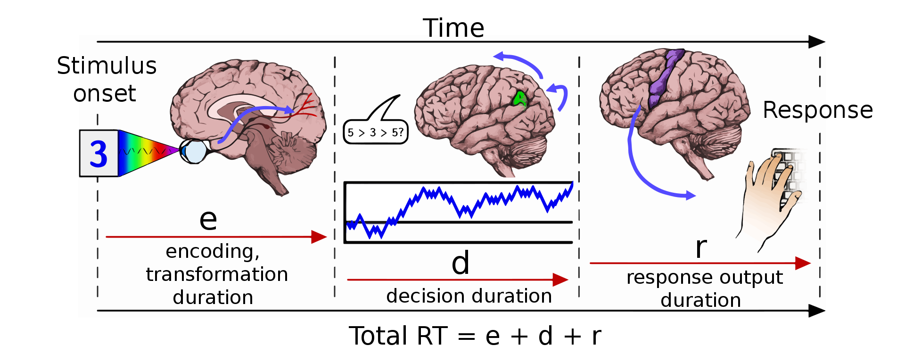

# Practicum 2 - Timers en Interrupts

In dit practicum zullen jullie de theoretische kennis over timers en (hardware) interrupts in de praktijk brengen. We doen dit door een programma te schrijven voor de microcontroller dat kan gebruikt worden om de menselijke reactietijd op te meten. Verdiep je eerst in de theorie over timers en interrupts vooraleer met dit practicum verder te gaan!

## Achtergrond

Menselijke reactietijden, of meer formeel het tijdsinterval tussen het aanbrengen van een stimulus en de menselijke reactie op die stimulus [1,2], worden uitvoerig bestudeerd in de psychologie en neurologie. Die metingen van de reactietijden (wat wetenschappers *mentale chronometrie* noemen) kunnen gebruikt worden om theoriën over de werking van ons zenuwstelsel en brein te toetsen. Ook helpt het met praktische vragen te beantwoorden, zoals het bepalen van de afstand die je met de auto aflegt tussen het moment waarop het licht rood geworden is, en het moment waarop je begint te remmen. Volgens onderzoek is de gemiddelde reactietijd voor visuomotorische interactie bij mensen ongeveer 220 ms [3]. Voor twintigers is de gemiddelde reactietijd eerder 190 ms [1].

## Opdracht 0: Meet je reactiesnelheid online

Surf naar [deze website](https://humanbenchmark.com/tests/reactiontime) om jouw reactietijd bij een visuele stimulus een aantal keer te meten.

## Impact van latency op de metingen

Valt je iets op aan de metingen t.o.v. de reactietijden die daarnet vermeld zijn (gemiddeld 220 ms)? De website geeft zelf al een hint in de *Statistics* pagina: Er zal altijd extra vertraging (*latency*) zijn door de hardware die je gebruikt. Enkele voorbeelden:

* De tijd tussen het induwen van je muisknop en het verwerken van die input door de PC
* De tijd tussen het commando van je PC en het moment waarop de groene kleur op je scherm verschijnt (dit kan gemakkelijk een aantal frames zijn, wat bij een 60Hz scherm snel oploopt).
* De tijd die je PC nodig heeft om te wisselen tussen de verschillende taken die uitgevoerd worden (in het vak besturingssystemen zullen jullie leren dat dit scheduling wordt genoemd).

In dit practicum gaan jullie een microcontroller gebruiken om veel **nauwkeurigere** metingen uit te voeren. Microcontrollers zijn immers bij uitstek geschikt voor **tijdkritische systemen**, zoals jullie in de kennisclips al geleerd hebben.

In dit practicum gebruiken we: 

* De LEDs als visuele stimulus.
* De druknoppen om een respons vast te leggen.
* Het LCD scherm om de resultaten weer te geven.
