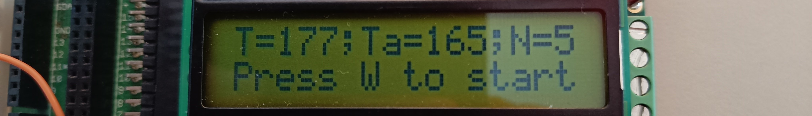

# Practicum 2 - Timers en Interrupts

## Oefening 2: Eerste versie van het meetsysteem

In deze oefening maken we een eenvoudige eerste versie van ons meetsysteem. Hierbij gaan we als volgt te werk:

* We printen de resultaten bovenaan op het LCD scherm.
* Bij het indrukken van de W-knop start een nieuwe meting:
    * Dan gebruiken we de _delay functies uit de AVR bibliotheek om actief te wachten (busy waiting in vakjargon).
    * Na een tijdje zetten we de LEDs aan.
    * Waarna we in een while-lus controleren of de C-knop is ingedrukt (polling in computer science vakjargon)
    * Wanneer de C-knop wordt ingedrukt, kijken we hoelang de LEDs al aan staan, dit is de reactietijd.
* We updaten de resultaten en wachten tot de W-knop opnieuw wordt ingedrukt om een volgende meting te starten.

Onderstaande pseudo-code in Python stijl geeft dit iets gestructureerder weer:

<pre>initialise the LCD and configure the microcontroller

while(True):
    print UI to the top row of the LCD:
    "T=&lt;latest-time in ms&gt;;Ta=&lt;average-time in ms&gt;;N=&lt;#measurements&gt;"

    print "Press W to start" to the bottom row.

    # wait for a W button press to start a new experiment

    while(True):
        if (W button pressed):
            break
        sleep for 1ms

    # start  the stimulus countdown
    clear the LCD
    print "LEDs -&gt; Press C" to the top row
    wait for 2s

    # apply stimulus
    turn on the LEDs

    # start counting and check for button press
    counter = 0
    while(True):
        counter += 1
        if (C button pressed):
            Turn off LEDs
            break
        sleep for 1ms

    update metrics for the UI</pre>

### Opdracht 2.1 - Implementeren van de eerste versie

**Implementeer bovenstaand algoritme nu op de microcontroller** door de pseudo-code om te zetten in C code voor de microcontroller. Aarzel niet om practicum 1 en de datasheet van de microcontroller erbij te nemen voor het aansturen van de LEDs en uitlezen van de knoppen. Je zou in staat moeten zijn om nu 5 keer je reactiesnelheid te meten, waarna het LCD eruit zou moeten zien als de bovenstaande afbeelding (op de reactietijden na natuurlijk).

### Opdracht 2.2 - Vergelijken reactietijden met de online metingen

Hoe zien je reactietijden eruit? Lijkt dit redelijk gegeven de informatie die je hebt gelezen in het begin van het practicum? Hoeveel extra latency werd door je PC veroorzaakt bij de metingen op de website?

### (Semi-)willekeurige wachttijden

Je hebt misschien ook al gemerkt dat je reactietijden korter worden naarmate je een aantal keer probeert. Dat is (deels) omdat de **wachttijd** voor de stimulus (de tijd tussen het starten van de meting en het activeren van de LEDs) **altijd dezelfde is**. Hierdoor kan je brein zich daar op kan instellen. Om dat te voorkomen gaan we nu een willekeurige tijd kiezen voor elke nieuwe poging.

Je zal merken dat je in de _delay_ms functie geen veranderlijke variabele kan gebruiken en dat je een compile error krijgt als je dit probeert:

<pre>double x;
// Choose random x
_delay_ms(x); 
// error: __builtin_avr_delay_cycles expects a compile time integer constant</pre>

Dat is omdat de compiler extra zijn best doet om zo exact mogelijk de gewenste tijd te benaderen, en daarom precies wilt weten hoelang die zal moeten wachten. Om dit te overkomen kan je in een **for-loop** een aantal keer 500 ms wachten, naargelang de gewenste wachttijd:

<pre>char amountOf500msSleeps = 6; // 3 seconds in total
for (char i = 0; i &lt; amountOf500msSleeps; i++){
    _delay_ms(500);
}</pre>

### Opdracht 2.3 - Implementeer de semi-willekeurige wachttijden

**Implementeer nu de semi-willekeurige wachttijden**. We kiezen tussen 2 s, 2.5 s, 3 s, 3.5 s en 4 s (aangezien we in veelvouden van 500ms gaan wachten). Voor de eerste meting nemen we altijd 3 s. Daarna dan gebruiken we de vorige reactietijd modulo 5 om de volgende wachttijd te kiezen uit de opties.

Onderstaande formule toont hoe je de vorige reactietijd kan gebruiken om te bepalen hoeveel keer je 500 ms zal wachten voor de volgende meting:

<pre>amountOf500msSleeps =  4 + previousReactionTime % 5; // Gelijk aan 4, 5, 6, 7 of 8</pre>

### Opdracht 2.4 - Vergelijk de reactietijden met de vorige metingen

**Meet nu nog eens 5 keer je reactiesnelheid**. Wellicht zal die iets hoger liggen dan daarnet omdat je brein zich nu minder kan voorbereiden. Bij onderzoek naar reactietijden wordt de wachttijd daarom ook altijd gerandomiseerd.

> De AVR bibliotheek voorziet ook een PseudoRandom Numer Generator (PRNG) die een veel grotere diversiteit aan willekeurige getallen kan afleveren. Bovendien heb je er in tegenstelling tot voor onze %5-methode geen user input voor nodig. Je vindt deze rand() functie hier. Ook hier zal je echter een seed of initiëel getal nodig hebben om willekeur te genereren, anders zal je programma exact hetzelfde zijn na elke reset. Op je laptop zijn er een aantal logische bronnen voor zo'n seed, bij microcontrollers is dit minder evident. Enkele opties zijn de tijd die verstrijkt voor een eerste knop wordt ingedrukt of het wegschrijven van een getal naar het persistent geheugen zodat je na elke reset van de microncontroller het getal kan aanpassen.

## Reflectie bij het huidige meetsysteem

Aan het meetsysteem dat we hierboven hebben opgesteld zijn er toch nog een aantal verbeteringen mogelijk:

Ten eerste zullen **de timings niet exact zijn**:

* De _delay functies zijn sterk geoptimaliseerd, maar wachten toch niet exact zo lang als je vraagt.
* Daarnaast is er ook nog de overhead van de code: Als we tijdens het wachten op de C knop na elke milliseconde nog een aantal andere instructies moeten uitvoeren, zal er onvermijdelijk een afwijking ontstaan tussen de counter en de effectief verstreken tijd. Een afwijking die bovendien steeds groter wordt! Je kan (terecht) denken dat de impact hiervan niet zo gigantisch groot is aangezien 1 kloktick van de microcontroller 1/16e6 seconden is, wat aanzienlijk kleiner is dan de grootteorde van onze metingen, die in milliseconden zijn. Toch loopt dit na 100ms al op tot 1ms, dat is dus al een fout van 1%.
* Ook het uitlezen van de knop gebeurt niet direct. Enkel wanneer de _delay functie is afgelopen zal een eventuele knopindruk effectief geregistreerd worden, waardoor we dus opnieuw een afwijking in de orde milliseconde introduceren.

Een eventuele oplossing is om de delays kleiner te maken waar nodig (bvb met behulp van de _delay_µs functie) en daarna metingen te doen van de overhead van de overige instructies om zo het programma te kalibreren. Dat is echter niet triviaal en bovendien ook zeer afhankelijk van de specifieke microcontroller en de exacte code.

Bovendien lost dit nog niet het tweede probleem op dat onze code momenteel heeft: het **actieve wachten met de delay functie zorgt ervoor dat we eigenlijk ondertussen niets nuttig kunnen doen**. Als we bijvoorbeeld enkele berekeningen willen uitvoeren, willen communiceren met andere toestellen of de LCD willen aansturen, moeten we die instructies in de wait loops toevoegen en zo veranderen we de timings opnieuw. Er is dus een **sterke koppeling tussen de tijdkritische code en de niet-tijdkritische code**.

Om deze problemen op te lossen gaan we gebruik maken van

1. Timers om exacte tijdsmetingen te doen die onafhankelijk zijn van de code die ondertussen uitgevoerd wordt en
2. Interrupts die toelaten om bepaalde gebeurtenissen zeer snel te registreren en af te handelen, onafhankelijk van de code die ondertussen uitgevoerd wordt.

Timers en Interrupts zijn essentiële elementen van microcontrollers en zullen in het project veelvuldig aan bod komen, neem dus zeker voldoende tijd om alles dat in dit practicum aan bod komt onder de knie te krijgen. Aarzel niet om vragen te stellen als bepaalde concepten niet duidelijk zijn.