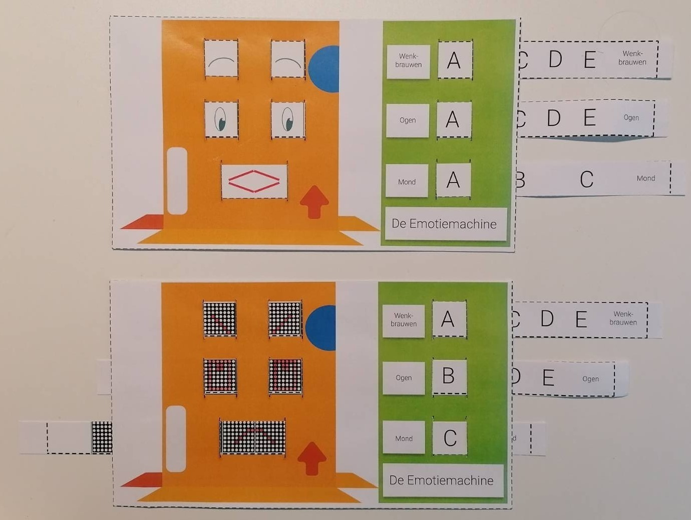

# Computationeel denken unplugged
## Emotiemachine
### 20 minuten in de klas

Deelnemers ontwerpen een gezicht en programmeren een 2D-robot gemaakt uit karton die verschillende emoties kan tonen. Ze stellen een tabel op die gebruikt kan worden om emoties (high-level) te vertalen naar instructies (code) die een machine kan verstaan (low-level). Ze moeten zelf de emoties tekenen op de stroken karton, voorgesteld door een bepaalde 'stand' van wenkbrauwen, ogen en mond.  

Later (tijdens de bouwsessies) kunnen ze de emoties ook programmeren met de ledmatrix van hun sociale robot. Hiervoor denken de leerlingen na over hoe ze de wenkbrauwen, ogen en mond kunnen voorstellen op de ledmatrix.  

Je kan hier eventueel ook kort vermelden hoe men  gezichtsherkenning (*facial recognition*) tegenwoordig probeert uit te breiden naar het herkennen van emoties m.b.v. AI.

By Abyssus - Own work, CC BY-SA 4.0

### Materiaal
* [Tabel emoties](embed/emotiemachine_gids.pdf "tabel")
* [Gezicht 1](embed/emotiemachine_gewoon_nl.pdf "gezicht gewoon")
* [Gezicht 2](embed/emotiemachine_matrices_nl.pdf "gezicht 2")