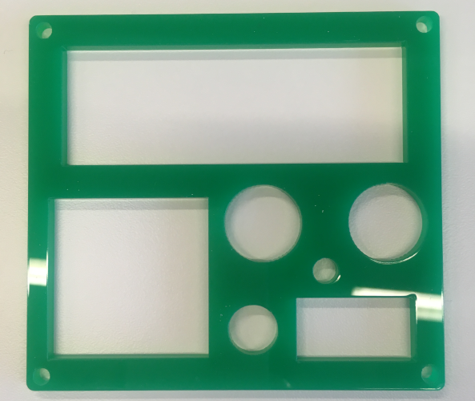

# Bouwen van de fysieke robot
## Uitsnijden van de uitsparingen

### Markeren van de doos
Denk goed na over waar je de elektronica gaat bevestigen op de doos. Eens je begint te snijden of prikken, wordt het moeilijk om fouten ongedaan te maken. Let op dat je (op de doos) voldoende ruimte laat langs de randen van de uitsparingen voor de bedrading.

Om je te helpen, is er een sjabloon voor de elektrische onderdelen uit de SR-kit.

Neem een dunne stift om de correcte plaatsen aan te duiden.  

### Snijden van de uitsparingen

Het uitsnijden kan met een **mesje** gebeuren of door te prikken met de bijgeleverde **priem** in de voorziene gleuven. 

**Veiligheidsinstructies**

1. Wees voorzichtig wanneer je snijgereedschap hanteert.

2. Neem snijgereedschap enkel bij de hand wanneer je het onmiddellijk nodig hebt.

3. Leg je gereedschap neer wanneer anderen in de buurt zijn of draai jezelf van hen weg.

4. Laat anderen niet schrikken wanneer ze scherp gereedschap vasthebben, want dan kunnen ze zich bezeren.

5. Houd het snijgereedschap met de scherpe kant van jezelf en anderen weg gericht.

6. Geef het snijgereedschap nooit rechtstreeks aan iemand anders. Leg het op een veilige plaats neer waar het niet kan wegrollen en laat de andere persoon het zelf oppikken. 

7. Houd er je aandacht bij wanneer je aan het snijden of prikken bent of het gereedschap vasthebt. Laat je niet afleiden en leid anderen ook zelf niet af.

8. Snijd altijd op een stabiele ondergrond, zodat je mesje of priem niet kan wegglijden. Gebruik hiervoor de bijgeleverde snijmat.