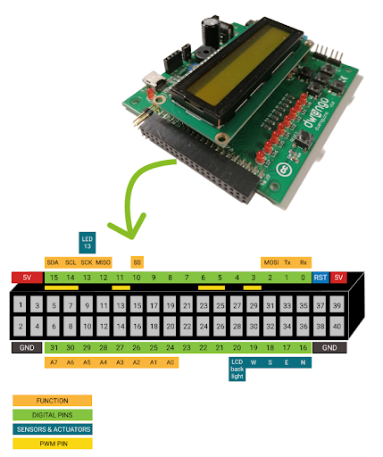

# Bouwen van de fysieke robot
## Uitsnijden van de uitsparingen

### Het moederbord
Je zal gebruik maken van de Dwenguino en het bijhorende uitbreidingsbord. Bij het snijden van de uitsparingen zal je hier dus ook plaats voor moeten voorzien!  

Let erop dat deze toegankelijk zijn zodat de USB-kabel comfortabel kan verbonden worden.

### Hoe bedraden
## Bedrading

Vooraleer je de onderdelen bevestigt op het lichaam van de robot, kan je best eerst de bedrading tussen het Dwenguino-borden de andere componenten voorzien. Dit kan noodzakelijk zijn, omdat er soms maar weinig ruimte overblijft om de draden aan te sluiten als je de component bevestigd hebt.

Onderstaande afbeelding toont welke onderdelen aanwezig zijn op de Dwenguino en welke actuatoren hier rechtstreeks op kunnen worden aangesloten.

*Op de Dwenguino kunnen rechtstreeks twee dc-motoren en twee servomotoren worden aangesloten. Het contrastvan het lcd-scherm kan worden aangepast. Je kan het microcontrollerplatform van stroom voorzien via de USB-kabel of een adapter.*

Alle andere sensoren en actuatoren moeten op de extension connector of een daarmee verbonden breadboard worden aangesloten.

### Met breadboard

Het voordeel van een breadboard te gebruiken is dat de connectoren op het breadboard al gelabeld zijn met de pinnummers of hun functie. Ook zijn de connectoren op het breadboard soms makkelijker bereikbaar als het breadboard zich in het lichaam van de robot bevindt.

**Opgelet**

Wees voorzichtig wanneer je het breadboard en de Dwenguino aan elkaar koppelt of van elkaar haalt. De pinnen kunnen gemakkelijk buigen als je te veel kracht gebruikt, waardoor het breadboard en de Dwenguino niet meer goed op elkaar aansluiten.

  

*Ledmatrix aangesloten op het breadboard van de Dwenguino. De ledmatrix kan nadien vastgemaakt worden op het lichaan van de robot.*

### Zonder breadboard

Als je geen breadboard gebruikt (bijvoorbeeld omdat er niet voldoende plaats is in de robot), dan kan je de sensoren rechtstreeks op de extension connector aansluiten. Gebruik daarvoor het onderstaande diagram om de functie van elke aansluiting na te gaan.

### Controleren van de aansluitpinnen

Om de bedrading juist te doen, moet je natuurlijk weten op welke pinnen van de Dwenguino je elke pin van de sensor of actuator moet aansluiten. Dit kan je terugvinden via het 'opties'-menu van elk onderdeel in het simulatieveld van het 'sociale robot'-scenario. Voor de gemakkelijkheid hebben we voor elke soort sensor ook al standaard pinnen gedefinieerd. 

## Standaard pinnen

Onderstaande afbeelding toont de standaard pinnummers voor de verschillende sensoren en actuatoren. Deze pinnummers werden ook voorzien op de bijbehorende blokken in de simulator.

**Sonar-sensor, geluidssensor, rgb-led en de ledmatrix**

* Deze onderdelen moeten nog verbonden worden met de Dwenguino. Je kan dus gebruikmaken van de default pinnummers zoals ze in de simulator voorzien zijn (aangeraden) of eigen pinnummers kiezen.

**lcd, buzzer, led 0-7 en 13, drukknoppen NOORD, OOST, WEST, ZUID, CENTRAAL, dc-motor 1 en 2, servomotor 1 en 2**

* Deze onderdelen zijn al voorzien op de microcontroller en de pinnummers kunnen dus niet aangepast worden.

## Bevestigen van sensoren en actuatoren

**Opgelet**

Controleer of je eerst de bedrading van de sensoren en actuatoren in orde moet brengen voordat je ze bevestigt op het materiaal. Als er weinig open ruimte rond de sensor voorzien is, zal het gemakkelijker zijn om eerst de draden aan te sluiten en nadien de sensor vast te maken.

Bij het Dwengo-materiaal zit een kit met hulpstukjes voor de bevestiging van de verschillende sensoren en actuatoren. Het materiaal van de kit ziet er ongeveer zo uit:

Daarnaast is er een doos met verschillende soorten bouten (dikte steeds 3 mm, maar van verschillende lengte) en moeren. Die kan je gebruiken voor alle onderdelen.

### Dwenguino

Voor de bevestiging van de Dwenguino aan het lichaam van de robot is er een Dwenguino frame voorzien dat kan vastgezet worden met vier bouten en moeren.

### Dc-motor

De dc-motor kan door middel van twee bouten en moeren worden vastgezet op een ander materiaal. Op de as van de dc-motor kan je nadien andere (roterende) onderdelen bevestigen, zoals de wielen van de robot. Maak je eigen roterende onderdelen? Dan kan je het arm-hulpstukje voor de dc-motor gebruiken om het onderdeel op de as te bevestigen.

**Opgelet**

Wees voorzichtig wanneer je het arm-hulpstukje weer van de servomotor wil verwijderen, want het is fragiel. Gebruik zeker twee handen, zodat het arm-hulpstukje niet breekt.

### Servomotor

De servomotor zet je vast met een hulpstukje en twee bouten en moeren. Je moet bovendien zorgen dat er een uitsnijding is voor het uitstekende deel. 
Het onderdeel dat je op de as van de servomotor wil bevestigen, kan je uitrusten met het arm-hulpstukje voor de servomotor. Zo kan je het onderdeel nadien gemakkelijk vastklikken op de as van de servomotor. Nadat het onderdeel is vastgeklikt, kan je het eventueel vastzetten met het extra schroefje dat in de verpakking van de servomotor zit. 

**Opgelet**

In tegenstelling tot de dc-motor is de volgorde van de kabels bij aansluiting op de Dwenguino wel van belang om de motor niet stuk te maken. Je kan de kleuren van de kabels als referentie nemen, waarbij bruin steeds de GND-pin (-) is.

### Sonar-sensor

De bevestiging van de sonar-sensor is eenvoudig. Nadat je de twee gaten (met behulp van de stencil) hebt uitgesneden, kan je de twee ronde kokers van de sonar-sensor door het karton duwen. Als je de gaten goed gesneden hebt, hoef je de sensor niet meer extra vast te maken. Eventueel kan je gebruikmaken van een latje uit de kit met hulpstukjes en twee schroeven om de sonar-sensor te klemmen tussen het karton en het latje. 

### Geluidssensor

De geluidssensor kan op dezelfde manier bevestigd worden als de sonar-sensor.

### Led-matrix
