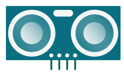
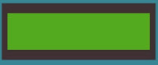

# Robotonderdelen
## Overzicht

Hieronder staan de verschillende robotonderdelen opgelijst die dwengo in het 'Sociale robot'-pakket voorziet.

## Sensoren (invoer)

| **Naam**      | **Afbeelding**                               | **Beschrijving**                                                                                                                                                                                                                                         |
|---------------|----------------------------------------------|----------------------------------------------------------------------------------------------------------------------------------------------------------------------------------------------------------------------------------------------------------|
| Knop          |            | Er zijn 5 ingebouwde drukknoppen voorzien op de dwenguino: NOORD, OOST, ZUID, WEST en MIDDEN.                                                                                                                                                            |
| Sonar-sensor  |     | Gebruik deze sensor om een persoon of object te detecteren en om te bepalen hoe ver van de sensor de persoon of het object zich bevindt. In de simulator is een schuifbalk voorzien om dit te simuleren. De sensor geeft de afstand terug in centimeter. |
| Geluidssensor |  | Gebruik deze sensor om geluid te detecteren. In de simulator is een knop voorzien waarmee je geluid kan simuleren door de knop in te drukken. Bij geluid geeft de sensor 1 terug, bij stilte 0.                                                          |

## Actuatoren (uitvoer)

| **Naam**           | **Afbeelding**                                 | **Beschrijving**                                                                                                                                                                                                                                                                                                                        |
|--------------------|------------------------------------------------|-----------------------------------------------------------------------------------------------------------------------------------------------------------------------------------------------------------------------------------------------------------------------------------------------------------------------------------------|
| Lcd-scherm         |          | Het lcd-scherm bevat twee regels met elk 16 karakters. De gewenste tekst geef je mee in je programma.                                                                                                                                                                                                                                   |
| Servomotor (blauw) |  | Een blauwe servomotor kan draaien over een bepaalde hoek tussen 0 en 180 graden. Bij gebruik in de simulator geef je de gewenste hoek mee in je programma.                                                                                                                                                                                     |
| Servomotor (zwart) |  | Deze motor kan volledig ronddraaien. Bij het gebruik van de zwarte servomotor geef je de gewenste snelheid mee van -255 tot 255.                                                                                                                                                                                                                         |
| Ledmatrix          |           | De ledmatrix is een vierkant met 64 leds in een vaste kleur. De matrix is ideaal om bepaalde patronen te laten oplichten, zoals een oog, een mond of een ander symbool. Er zijn blokken voorzien om de patronen te maken. Je kan de matrices ook met elkaar verbinden (maximaal 4) als je meerdere matrices op je robot wil bevestigen. |
| RGB-led            |                | De RGB-led is een led die geen vooraf ingestelde kleur heeft. Je kan de led in een bepaalde kleur laten oplichten door een waarde tussen 0 en 255 voor rood, groen en blauw in te stellen.                                                                                                                                              |