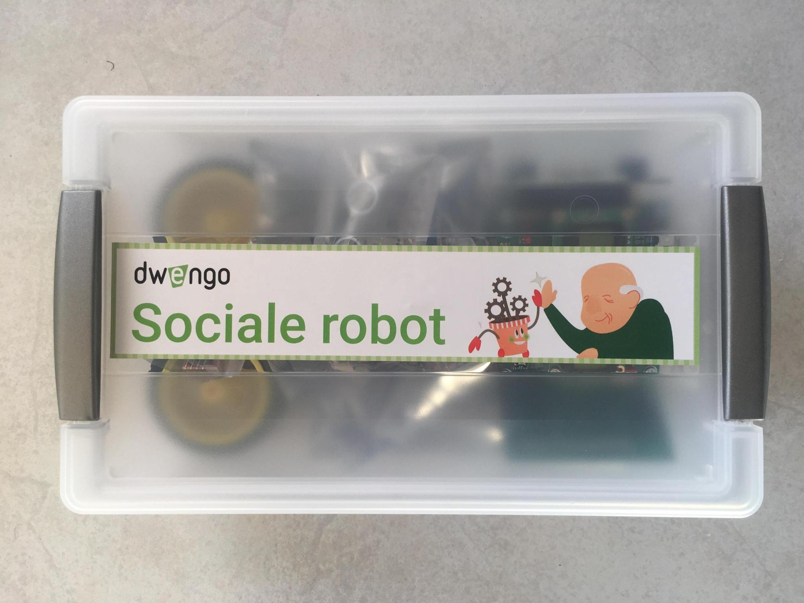
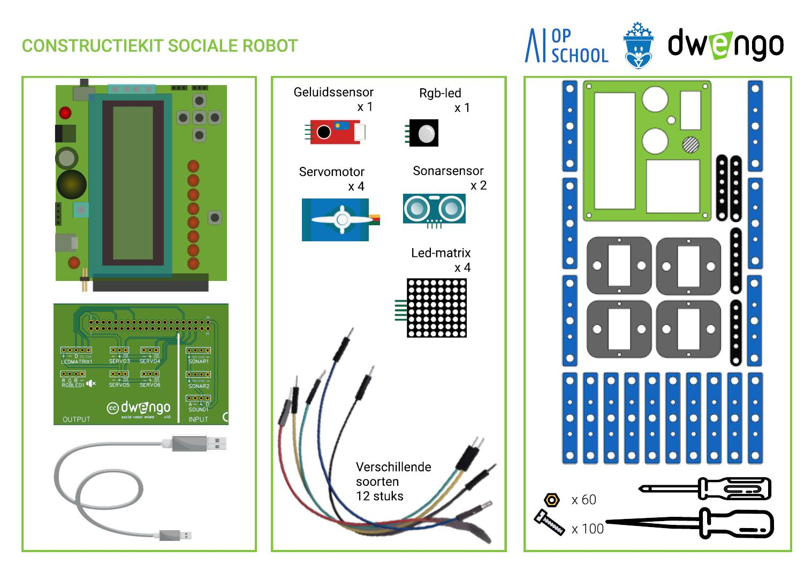

# Logistiek SR-kits
Dwengo heeft voor het 'Sociale robot'-project een kit ontwikkeld met elektronica en gereedschap voor het bouwen van een eigen sociale robot.  

Eén zo'n kit bevat het onderstaande materiaal:  

Bij elk pakket wordt ook een [ficheboekje](embed/Ficheboekje.pdf "Ficheboekje") meegeleverd. Hierin staan de fiches die gemaakt werden voor de leerlingen met extra uitleg, zodat jij optimaal voorbereid bent.

## Materiaal kopen
Dwengo verkoopt deze kits in sets van 5 SR-kits. Voor meer informatie kan je ons <a href="mailto:info@dwengo.org">hier</a> contacteren.

## Materiaal ontlenen
Voor scholen uit de provincie Oost-Vlaanderen stelt de provincie 6 sets ter beschikking. Deze kunnen in overleg met de verantwoordelijken ontleend worden via <a href="mailto:jorinde.lannau@oost-vlaanderen.be">mail</a>.  
