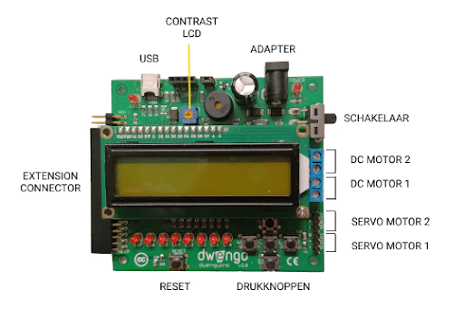

# Bouwen van de fysieke robot
## Het moederbord
Je zal gebruikmaken van de Dwenguino en het bijbehorende uitbreidingsbord. Bij het snijden van de uitsparingen zal je hier dus ook plaats voor moeten voorzien!  

Houd er rekening mee dat de USB-poort van de Dwenguino toegankelijk moet zijn om de USB-kabel comfortabel aan te sluiten.

### Bedrading en monteren

Voordat je de onderdelen op het lichaam van de robot bevestigt, is het verstandig om eerst de bedrading tussen de Dwenguino en de andere componenten aan te sluiten. Dit voorkomt dat er te weinig ruimte overblijft om de draden aan te sluiten, nadat de componenten zijn bevestigd.

Onderstaande afbeelding toont welke onderdelen aanwezig zijn op de Dwenguino en welke actuatoren hier rechtstreeks op kunnen worden aangesloten.

*Het contrast van het lcd-scherm kan worden aangepast. Je kan de Dwenguino van stroom voorzien via de USB-kabel of een adapter.*

Op de *extension connector* zal je het uitbreidingsbord kunnen aansluiten (zie afbeelding). Dit is speciaal op maat gemaakt voor de sociale robot. Hiermee kan je alle andere sensoren en actuatoren aansluiten.  

