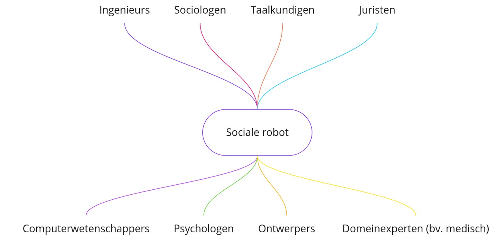

# Doelen

## Een sociale robot...

Sociale robots zijn robots die specifiek ontworpen zijn om te communiceren met mensen en deel te nemen aan sociale interacties. Het uiteindelijke doel van een sociale robot is om de interactie tussen mens en machine zo natuurlijk mogelijk te maken.

Bij het ontwerpen van een sociale robot is het belangrijk om niet alleen te focussen op de efficiëntie van de robot in het uitvoeren van zijn taken, maar ook op de sociale en emotionele aspecten van de interactie tussen de robot en de mens. Dit vereist kennis van verschillende domeinen zoals de techniek, het menselijk gedrag en de esthetiek. Sociale robotica vereist dus een interdisciplinaire aanpak vanwege de complexe interactie tussen de robot, zijn omgeving en de mensen die ermee interageren. 

### Ontwerpen

De leerlingen krijgen volledige controle over het ontwerp van hun sociale robot. Zij zijn de architecten van hun eigen creatie en hebben de mogelijkheid om hun unieke visie en persoonlijke stijl tot uiting te brengen in het ontwerp. Dit stelt hen in staat om hun technische en creatieve vaardigheden te ontwikkelen en een gevoel van trots te ontwikkelen bij het bouwen van een robot die volledig op hun eigen ideeën en inzichten gebaseerd is.

Met behulp van gerecycleerde materialen, knutselmateriaal en elektronische componenten, hebben de leerlingen de mogelijkheid om hun robot vanaf de grond op te bouwen. Door deze aanpak kunnen ze niet alleen hun technische vaardigheden ontwikkelen, maar ook hun creatieve en probleemoplossende vaardigheden aanscherpen. 

### Programmeren

Om leerlingen op een toegankelijke manier kennis te laten maken met de basisprincipes van programmeren, maken ze gebruik van de dwenguino-simulator in dit project. Deze simulator is ontworpen voor beginners die op zoek zijn naar een eerste (grafische) programmeerervaring. Deze basis kan hen in de toekomst helpen bij de overgang naar tekstuele programmeertalen.

Bij het programmeren van de sociale robot, wordt het computationeel denken van de leerlingen aangescherpt en krijgen ze inzicht in hoe de robot functioneert en reageert op de omgeving. Door het schrijven van code en het testen van de functionaliteit van de robot kunnen ze o.a. hun probleemoplossende vaardigheden verbeteren.

### Bouwen

Als laatste onderdeel van het project dienen de leerlingen hun virtuele robot om te zetten naar de fysieke realiteit.

De leerlingen krijgen herbruikbaar materiaal en een microcontrollerplatform ter beschikking om hun robot te bouwen. Ze zullen moeten nadenken over de materialen die ze willen gebruiken en hoe ze deze materialen kunnen combineren om de robot te construeren. Hierbij is het ook belangrijk dat ze rekening houden met de functionaliteit en het ontwerp van de robot die ze hebben ontworpen in de vorige modules.

Het bouwproces biedt een breed gamma aan mogelijkheden waarvoor tal van vaardigheden nodig zijn, waardoor het een ideale gelegenheid is om de vakken techniek en beeld te integreren in het project.