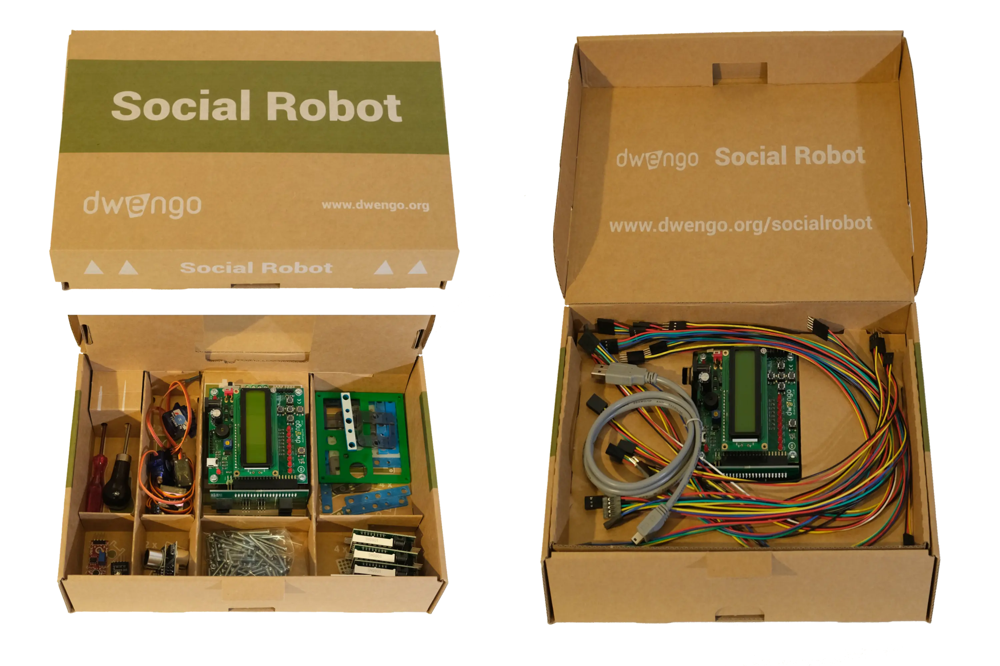
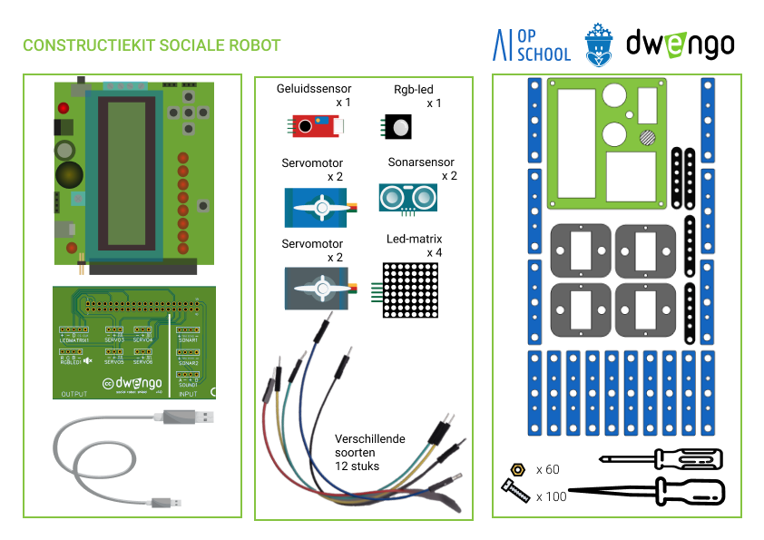

# Materiaal

Dwengo heeft voor het 'Sociale robot'-project een kit ontwikkeld met elektronica en gereedschap voor het bouwen van een eigen sociale robot.  

Eén zo'n kit bevat het onderstaande materiaal:  

Bij elke set wordt ook een [**ficheboekje**](embed/ficheboekje_leerkracht.pdf "Ficheboekje") meegeleverd. Hierin staan de fiches die gemaakt werden voor de leerlingen met extra uitleg, zodat jij optimaal voorbereid bent.

## Materiaal kopen
Dwengo verkoopt deze kits in sets van 5. Voor meer informatie kan je in [**onze webshop**](https://www.dwengo.org/shop/) terecht.

## Materiaal ontlenen
Voor scholen uit de [**provincie Oost-Vlaanderen**](https://oost-vlaanderen.be/leren/educatief-materiaal/de-sociale-robot.html) stelt de provincie 6 sets ter beschikking. Deze kunnen in overleg met de verantwoordelijken ontleend worden via <a href="mailto:jorinde.lannau@oost-vlaanderen.be">mail</a>.  

Scholen van het [**Provinciaal Onderwijs Vlaanderen**](https://povsites.be/stem/voorbereiding-project-sociale-robot/) kunnen terecht bij hun [pedagogische begeleidingsdienst](https://povsites.be/stem/voorbereiding-project-sociale-robot/#kits-en-lesfiches).

De [**cel iSTEM inkleuren**](https://istem.be/) heeft ook enkele sets om uit te lenen. Contacteer de cel via <a href="mailto:contact@istem.be">mail</a>. 
