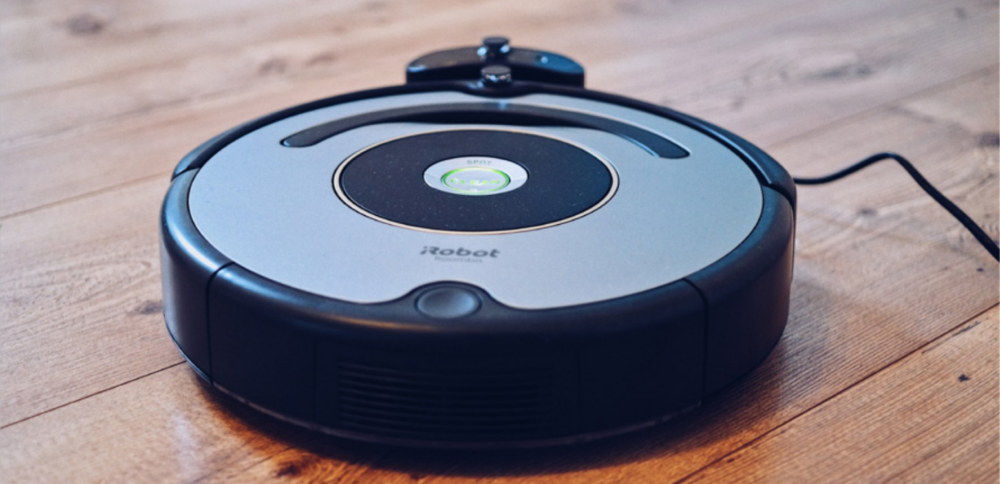

# Wat zijn sociale robots?
## Digitale systemen

*Vandaag de dag zijn digitale apparaten niet meer weg te denken uit onze maatschappij. Denk maar aan een stofzuigerrobot, een wasmachine, een elektrische tandenborstel of een wekkerradio.*

Men spreekt ook van **digitale systemen**. Veel van die apparaten worden aangestuurd door een **microcontroller**. Digitale systemen beschikken over ingangen en uitgangen. De microcontroller krijgt gegevens van de ingangen (**input**). Hij **verwerkt** de gegevens, voert berekeningen uit en stuurt vervolgens de digitale apparaten aan (**output**).  
In dit project, gebruik je de **Dwenguino**. Dat is een microcontroller-platform waarmee je snel en gemakkelijk je eigen apparaat kan bouwen.

> Discussie Is een stofzuigerrobot een sociale robot?

© Jens Mahnke via Pexels