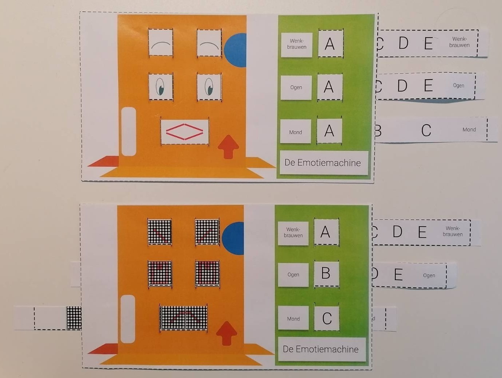

# Computationeel denken unplugged
## Emotiemachine
### 20 minuten in de klas

De leerlingen ontwerpen een gezicht en programmeren een 2D-robot van karton om verschillende emoties uit te drukken. Ze maken een tabel waarin ze emoties (high-level) omzetten in instructies (code) die door een machine (low-level) begrepen kunnen worden. Vervolgens tekenen ze de emoties op stroken karton die een bepaalde stand van de wenkbrauwen, ogen en mond vertegenwoordigen.

Later (tijdens de bouwsessies) kunnen ze de emoties ook programmeren met de ledmatrix van hun sociale robot. Hiervoor denken de leerlingen na over hoe ze de wenkbrauwen, ogen en mond kunnen voorstellen op de ledmatrix.  

Je kan hier eventueel ook kort vermelden dat men tegenwoordig gezichtsherkenning (*facial recognition*) probeert uit te breiden naar het herkennen van emoties m.b.v. AI-technieken. Zo kunnen computers steeds beter emoties herkennen in gezichtsuitdrukkingen, wat kan leiden tot nieuwe toepassingen in o.a. de gezondheidszorg en beveiliging.

By Abyssus - Own work, CC BY-SA 4.0

### Materiaal
* [Tabel emoties](embed/emotiemachine_gids.pdf "tabel")
* [Gezicht 1](embed/emotiemachine_gewoon_nl.pdf "gezicht gewoon")
* [Gezicht 2](embed/emotiemachine_matrices_nl.pdf "gezicht 2")