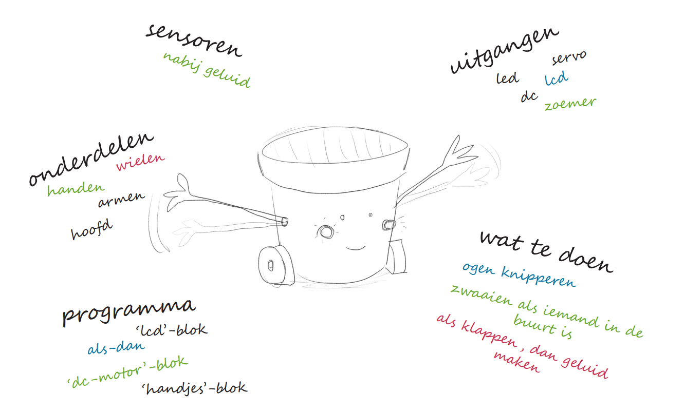

# Brainstorm & Ontwerp

De leerlingen beschikken nu over alle basisvaardigheden die ze nodig hebben om hun eigen sociale robot te ontwerpen! Ze weten wat sociale robots zijn en hoe ze werken, en ze begrijpen hoe ze functioneren en 'denken'.

Om het ontwerpen van hun sociale robot vlotter te laten verlopen, vind je hier enkele tips die je kunnen helpen bij het ondersteunen van de leerlingen.

### Brainstormtechnieken

#### Techniek 1: Brainwriting

De leerlingen schrijven zoveel mogelijk ideeën neer op papier binnen een afgesproken tijd (bijvoorbeeld 5 minuten). Tijdens het schrijven wordt er niet met elkaar gesproken of naar anderen hun ideeën gekeken.

Eens de tijd op is, vergelijk en bespreek je de ideeën.

ALs je merkt dat je bepaalde ideeën gemakkellijk kan groeperen, kan het interessant zijn om op dit moment de leerlingen op te delen in groepjes o.b.v. gelijkenissen in hun ideeën.

#### Techniek 2: Mindmaps

Deze techniek zijn ze misschien al eens tegengekomen tijdens het studeren. Ze is echter ook zeer nuttig tijdens het brainstormproces.

Laat de leerlingen "Sociale Robot" in het midden van een blad schrijven. Dit is hun vertrektpunt. Rond dit vertrekpunt schrijven ze de zaken waaraan dit onderwerp hen doet denken en ze verbinden deze met het midden m.b.v. een lijntje. Dit proces kunnen ze dan herhalen met de nieuwe woorden als vertrekpunt.

Het kan nuttig zijn om niet alleen met woorden te werken, maar ook tekeningen toe te voegen. Op die manier kunnen sommige ideeën en concepten beter worden weergegeven.

### Ontwerpen

Geef de leerlingen <strong>papier</strong> en <strong>stiften</strong>. Moedig hen zeker aan om tekeningen te maken en verschillende ideeën uit te proberen.  

Zorg ervoor dat alle leerlingen zich op hun gemak voelen bij het tekenen en het delen van hun ontwerpen. Moedig hen aan om open te staan voor elkaars ideeën en om samen te werken aan het verbeteren van hun ontwerp. Het kan daarom interessant zijn om diverse voorbeelden (zowel "mooi" als "lelijk") te tonen van ontwerpen, waarbij je duidelijk maakt dat het belangrijker is om een functionele schets te maken dan een kunstwerk.

Om de creativiteit van de leerlingen niet te beknotten, is het aan te raden om de leerlingen eerst hun <strong>droomrobot</strong> te laten ontwerpen.  

Nadien kan je hen er dan (waarschijnlijk) op wijzen dat deze niet haalbaar is binnen de context van het project. Je overloopt samen met hen de beperkingen zoals het beschikbare materiaal en hun eigen vaardigheden. Dit luidt dan de tweede fase van het ontwerpproces in. De leerlingen denken na over welke aanpassingen ze moeten maken aan hun droomrobot om een nieuw ontwerp te bekomen dat wel realiseerbaar is. Dit tweede ontwerp noemen we de <strong>technische tekening</strong>.

Eens de leerlingen effectief beginnen aan het ontwerpproces van de robot, zullen ze ideeën uitwisselen over het uiterlijk, de functionaliteiten, het materiaal...

Ze brainstormen dan binnen hun groep over **hun** sociale robot. Als je merkt dat ze het moeilijk hebben om een startpunt te vinden of vooruitgang te boeken zijn hier alvast enkele voorbeeldvragen die hen op weg kunnen zetten:

* Hoe moet je robot eruit zien?
* Wat moet je robot kunnen?
* Hoe zal je robot mensen kunnen waarnemen?
* Hoe zal je robot interageren met mensen?
* Heeft je robot een naam?
* Wat kan je verwezenlijken met het beschikbare materiaal?
* Met welke beperkingen of criteria moet je rekening houden?
* ...

Als een groep teveel wilt doen, zullen ze keuzes moeten maken:

* Wat moet je robot minstens kunnen?
* Welke dingen kan je eventueel achteraf nog doen als er tijd over is?
* ...

---
Eens ze tevreden zijn met hun ontwerp, formuleren ze criteria op basis waarvan ze op het einde hun robot kunnen evalueren. Dit kunnen zeer uiteenlopende criteria zijn, afhankelijk van hun ontwerp. Hieronder vind je alvast enkele voorbeelden:

* De robot heeft armen.
* De armen kunnen bewegen.
* De robot zwaait.
* De robot heeft ogen.
* De robot reageert wanneer iemand te dicht komt.
* De robot lijkt op een neushoorn.
* ...
