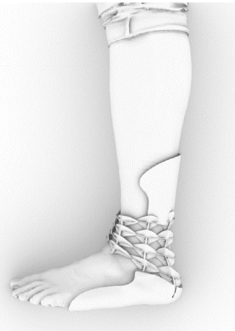

# Enkel-voet-ortheses op basis van een zeepaardje

We kijken dus naar de nekregio van een zeepaardje om een enkel-voet-orthese te maken. Het benige pantser van een zeepaardje bestaat uit benige platen die in elkaar kunnen glijden. De benige platen hebben een uitstekende stekel, de volgende plaat heeft een groeve waar die stekel vlotjes in en uit kan glijden. Zo kan een zeepaardje zijn staart vlot bewegen in verschillende richtingen. Maar ook ter hoogte van de nek en buik vind je hetzelfde systeem terug.

Hieronder zie je de structuur van de beenplaten bij een zeepaardje:
(figuur)

Zoals eerder aangegeven kan de nek van een zeepaardje strekken en terugtrekken, maar kan het zich in de zijdelingse richtingen veel minder bewegen. Dit is wat we nodig hebben voor de enkel-voet-orthese. Hierbij moet de voet zijdelings gefixeerd worden, maar mag die wel nog in de zogenaamde dorsale en plantaire richtingen (zie figuur) bewegen. 

De enkel-voet-orthese bestaat uit ge-3D-printe platen gebaseerd op de bouw van de nekregio van een zeepaardje. Het eindresultaat wordt aangevuld met twee schelpen, bovenaan en onderaan om zo tot een werkbare enkel-voet-orthese te komen. 

