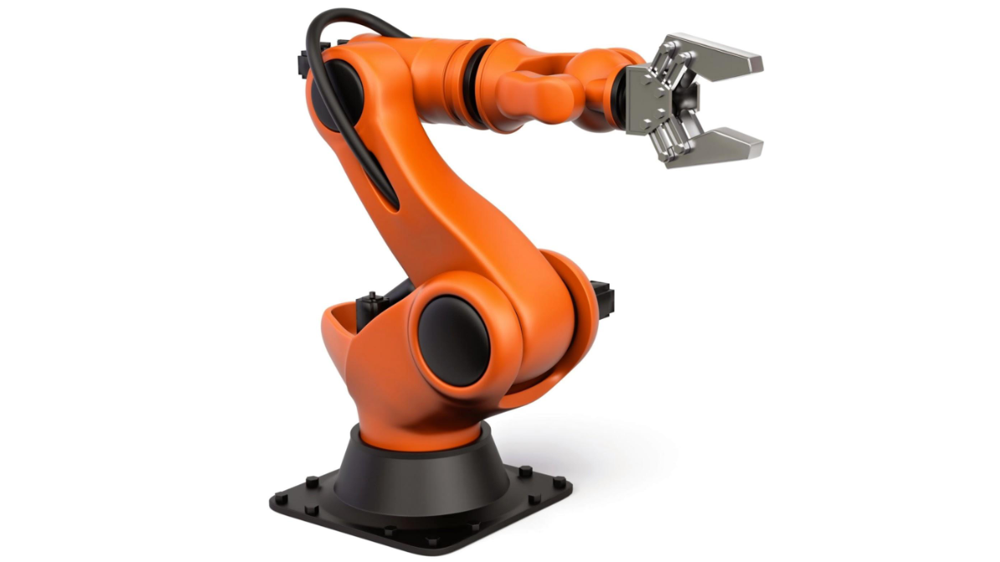

# Qu'est-ce qu'un robot ?

*Quels robots as-tu vu ?*

En 1495, Léonard de Vinci a conçu un « lion mécanique » qui pouvait se déplacer selon des principes mécaniques. Cependant, ce n'est qu'en 1961 que l'industrie accueille le premier robot : l'Unimate. Vous pouvez programmer ce bras robotique pour effectuer des tâches de manière indépendante. Des variantes avancées de l'Unimate sont encore utilisées aujourd'hui, par exemple pour la microchirurgie.

Parallèlement au développement de tels robots industriels, les chercheurs ont commencé à construire systématiquement des robots avec des jambes en 1950. Les descendants les plus célèbres de ceux-ci sont sans aucun doute l'ASIMO de Honda (qui a une forme humaine) et l'Aibo de Sony (un chien robot).

De plus, les chercheurs ne s'intéressent pas seulement à la construction mécanique : ils s'intéressent aussi de plus en plus aux compétences sociales des robots. Par exemple, KISMET du MIT, des années 90, vous sourit. Les robots avec des expressions faciales sont utilisés, entre autres, comme réceptionnistes dans les hôtels ou les hôpitaux.

