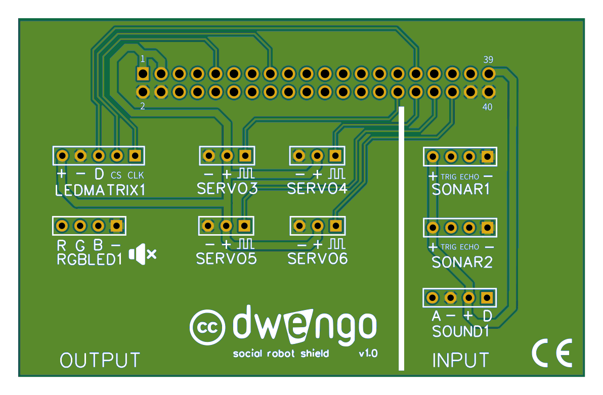

# Bouwen van de fysieke robot
## Het uitbreidingsbord

Een bijkomend voordeel van het gebruik van een uitbreidingsbord is dat de connectoren gelabeld zijn met de specifieke sensoren of actuatoren waarvoor ze bedoeld zijn.

Wees voorzichtig bij het aansluiten of losmaken van het uitbreidingsbord en de dwenguino. De pinnen buigen zeer gemakkelijk, waardoor een goede verbinding tussen het uitbreidingsbord en de dwenguino niet meer mogelijk is.

### Bedrading en monteren
Bij het inpluggen van je pinnen is het belangrijk dat je de juiste zaken met elkaar verbindt. De sensoren en actuatoren hebben bij hun connectoren zaken zoals '+', '-', 'GND' staan en het is ook belangrijk dat je deze met de overeenkomstige pin op het uitbreidingsbord verbindt.

M.b.v. [deze fiches](embed/leerlingenfiches.pdf "fiches") kan je dit gemakkelijk doen.  

Eens de bedrading in orde is, kan je de elektronica monteren op het lichaam van de robot.  

Als je moeite hebt om bepaalde zaken vast te maken aan het lichaam, kan je ook hiervoor in de fiches kijken. Daar tonen we je dan hoe je met de hulpstukken snel iets kan vastmaken.