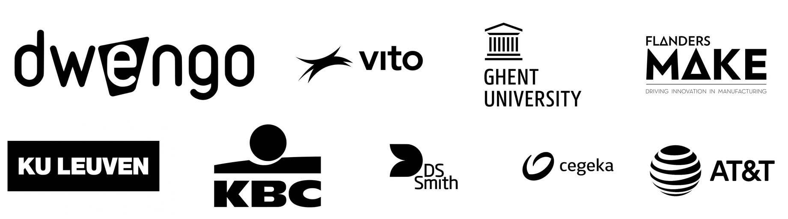

# Wat is WeGoSTEM?

Ben je leerkracht in de derde graad van het basisonderwijs? Wil je leerlingen enthousiasmeren voor techniek en informaticawetenschappen? Dan ben je bij WeGoSTEM aan het juiste adres. Wij bieden je al het materiaal om met jouw leerlingen een kunstrobot te bouwen en te programmeren. Een robot die zelf kan tekenen. Zo verwerven jouw leerlingen een heleboel STEM-vaardigheden, van techniek tot computationeel denken.

Dat klinkt bijna te mooi om waar te zijn. Toch werkt het. Meer dan 25.000 kinderen over heel Europa gingen al met het materiaal aan de slag. Over WeGoSTEM werd dus goed nagedacht. De lesinhouden zijn logisch opgebouwd, sluiten goed aan bij de mogelijkheden van de leerlingen, en passen precies in twee lesuren:

###### **Eerste lesuur**
* een klasgesprek over robots (10 - 15 min);
* programmeer eens een mens (10 - 15 min);
* bouwen van een tekenrobot (25 min);
  
###### **Tweede lesuur**
* programmeren van de tekenrobot en experimenteren (40min);
* opruimen (10 min).

Een handige samenvatting kan je 
[**hier**](embed/WeGoSTEMoverzichtleerkrachten.pdf "Samenvatting WeGoSTEM") 
downloaden. 

# Hoe werkt het?

Wil je graag aan de slag? Lees dan verder. In wat volgt doorlopen we met jou het WeGoSTEM-leerpad. Je ontdekt de diverse activiteiten die we voor jouw leerlingen hebben uitgewerkt. Bij elke activiteit krijg je een woordje uitleg. Zo bereidt dit leerpad je perfect voor om jouw leerlingen te ondersteunen wanneer ze zelf aan het leerpad beginnen.

Opgelet, de leerlingen bouwen in deze les zelf een robot. Het materiaal dat ze daarvoor nodig hebben, kan je gratis reserveren in een bibliotheek in jouw buurt.

Als je extra kennis hebt over robots, deel die dan gerust met de leerlingen! De tijdsindicatie is een suggestie, maar uiteraard aanpasbaar aan de noden van de klas. 

Kinderen zijn in elk geval laaiend enthousiast wanneer ze met hun eigen robottekening naar huis kunnen!

Indien er na het leerpad nog vragen zijn, kan je ons altijd contacteren op [scholen@dwengo.org](scholen@dwengo.org"mail").

Dit leerpad wordt aangeboden in samenwerking met:

