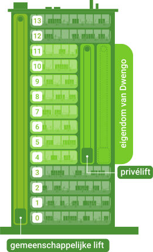

# The Challenge
The offices of Dwengo are located on the fourth to the eleventh floor of an office building. There is a shared elevator for all the companies in this building. However, this elevator can only be used to move to and from the entrance and not for movement between floors. Below you can see a drawing of what the office building looks like.

The employees of Dwengo can move between their own floors using a private elevator. Because the number of employees has increased significantly in recent years, the elevator is often overloaded. To solve this, Dwengo has decided to install an additional private elevator. To use this efficiently, they decide to ensure that the two elevators serve their own collection of floors where they stop. For example, one elevator only stops at the even floors and the other elevator only at the odd floors. Note that as a result, it is no longer possible to move between even and odd floors using the elevator. These people must take the stairs.

As there are not an equal number of movements between the different floors, Dwengo wants to choose the division in such a way that as few people as possible have to take the stairs. Below you will find an overview of the movements that take place on an average day.

| From Floor | To Floor |
| ----------- | ----------- |
| 4      | 8, 10, 10, 8, 6, 6        |
| 5   | 8, 8, 9, 9, 11, 11, 11, 9, 8         |
| 6   | 10, 8, 10, 4         |
| 7   | 10, 10, 11, 11, 11, 5, 11, 5, 9, 9, 5, 10, 10         |
| 8   | 5, 5, 4, 6, 4, 6, 5, 10, 10         |
| 9   | 5, 5, 11, 11, 7, 11, 7, 5         |
| 10   | 6, 8, 8, 7, 6, 7, 6         |
| 11   | 7, 5         |

On which floors should each of the elevators stop to ensure that as few people as possible have to take the stairs? The two elevators each stop on their own four floors, these collections do not overlap.