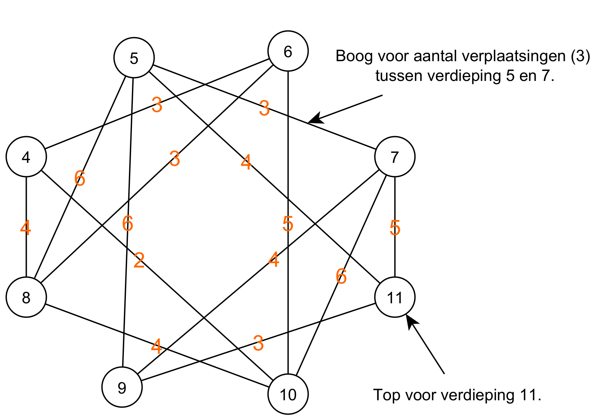

# Choosing a Data Structure

Representing the problem with a known data structure allows us to use all the algorithmic techniques that exist for that data structure. Therefore, choosing an appropriate data structure can make it easier to solve the problem.

|  | **4** | **5** | **6** | **7** | **8** | **9** | **10** | **11** |
| ----------- | ----------- |----------- | ----------- |----------- | ----------- |----------- | ----------- |----------- |
| **4** | 0 | 0 | 2 | 0 | 2 | 0 | 2 | 0 |
| **5** | 0 | 0 | 0 | 0 | 3 | 3 | 0 | 3 | 
| **6** | 0 | 0 | 0 | 0 | 1 | 0 | 2 | 0 | 
| **7** | 0 | 0 | 0 | 0 | 0 | 2 | 4 | 4 | 
| **8** | 0 | 0 | 0 | 0 | 0 | 0 | 2 | 0 | 
| **9** | 0 | 0 | 0 | 0 | 0 | 0 | 0 | 3 | 
| **10** | 0 | 0 | 0 | 0 | 0 | 0 | 0 | 0 |
| **11** | 0 | 0 | 0 | 0 | 0 | 0 | 0 | 0 |

If you already have some knowledge of computer science, this type of matrix may look familiar to you. After all, this matrix has the same structure as the arc matrix or adjacency matrix of a graph (**pattern recognition**). We can therefore also represent this matrix graphically as a graph (Figure 1). A graph is a collection of nodes (= the circles), which are connected by arcs (= the lines between the circles). A knot represents a floor. An arc represents the number of moves between the two adjacent nodes/floors.

|  | 
| ---- |
| **Figure 1**: Represents movements between floors as a graph. |