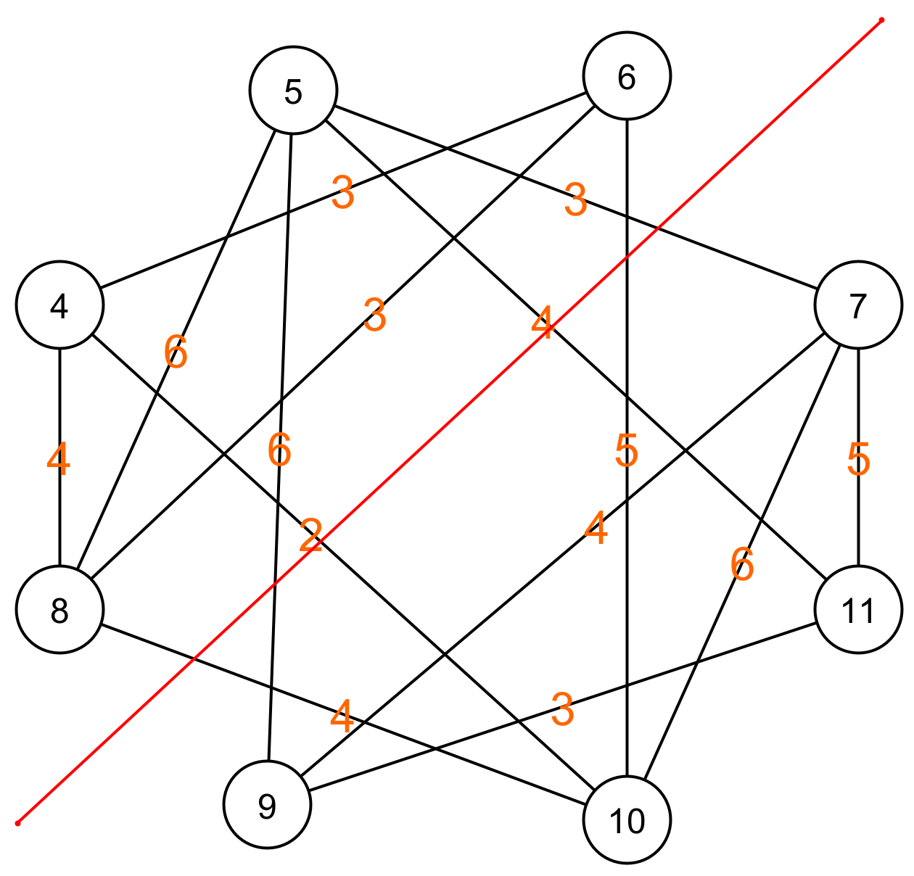
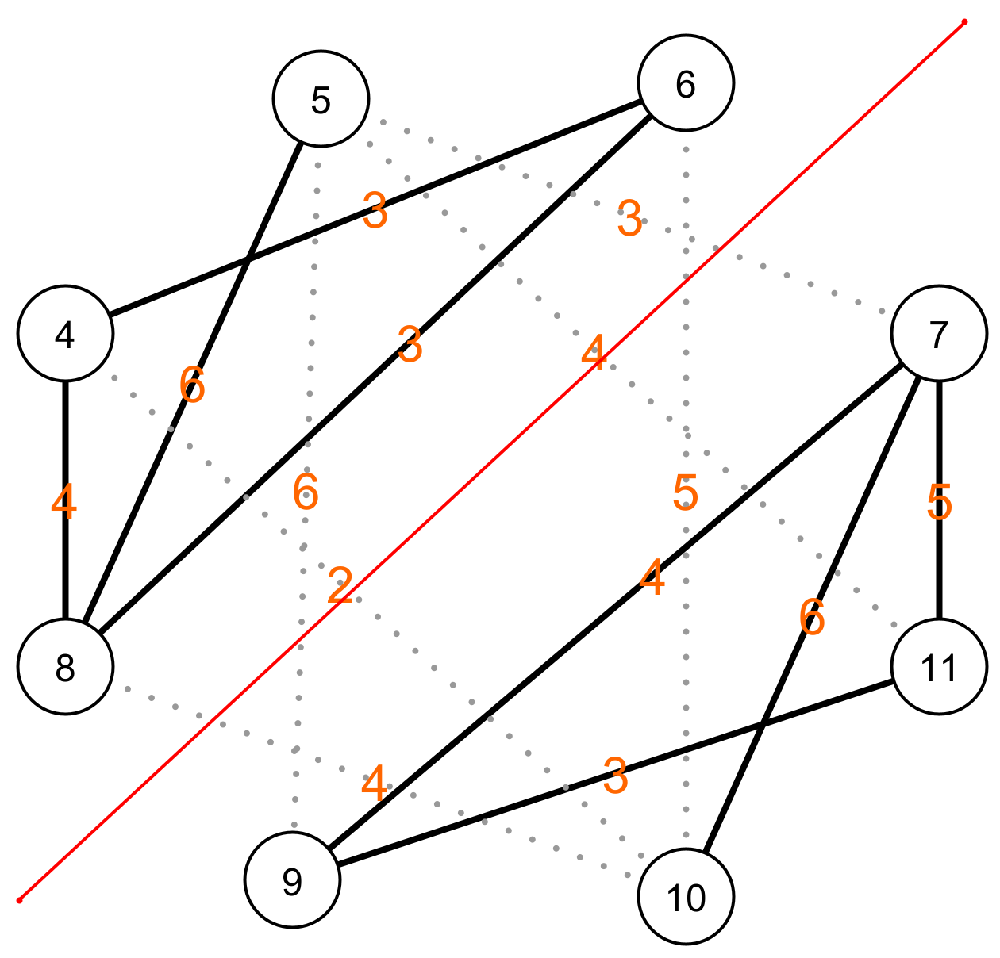

# Reframing the Problem

Now that we have an **abstract representation** of the movements between different floors, we can restate the problem in terms of that:

> How do you cut a graph into two equal pieces such that the sum of the number of edges you cut is as small as possible?

|  |  |
| - | - |
| Here you see an example of how we can cut the graph into two equal pieces. The red line represents the line along which we cut the graph. Every edge that crosses the line is cut. The total cost of the cut is then the sum of the weights of all the edges that we cut.  |  |
|  |  |
| In this image, you see the edges that are being cut, represented by a dashed line. This collection of edges is called a cut. The total cost of this cut is the sum of the weights on the dashed lines. 3 + 5 + 4 + 2 + 6 + 4 = 24 |  |
|  |  |

To solve our problem, we're looking for a cut of the graph with a minimal cost.

Our problem is not yet solved; in fact, we still have to start working on it. So far, by using abstraction and pattern recognition, we have transformed the problem into a structure with which a computer can easily deal. This is the essence of computational thinking. We transform a problem so that it becomes easier to think about, as well as to solve with a computer.