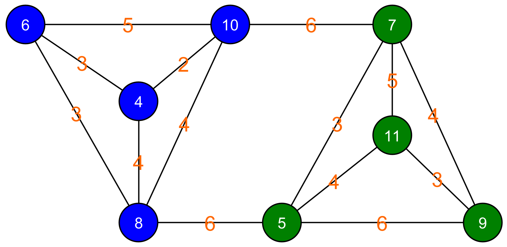

# Graphical solution

By drawing the graph and moving the nodes, we can also find a solution. Below you see the graph where we have given even (blue) and odd (green) floors their own label. In this representation, it is not immediately clear how we should divide the graph into two. However, we can move the nodes to get a clearer view of how the graph can be cut.

Below we see that by restructuring the graph we can get a clear picture of how the cut can be made.

This also clearly shows that the minimum cut cost is equal to twelve.

In this specific graph, we can also see that this is the best cut, as switching any node between the groups will always result in a higher cut cost.

The brute force method can often be used as a first option to solve a problem computationally. In our case, because the graph we are working on is small, this is still doable. However, our algorithm increases exponentially in complexity as the number of nodes increases (\\(O(n!)\\)). Note that for a graph of 20 nodes, there are already 184,756 possible distributions of the graph. For a graph with 30 nodes, that number is 155,117,520 and for 40 nodes it is 137,846,528,820. The number of required calculations thus rises exponentially with the number of nodes.

The amount of computing power needed to solve a problem is often expressed by computer scientists in terms of the size of the input. This amount of computing power is also called the <strong>complexity</strong> of the algorithm. If the size of the input is equal to \(n\), then we express the complexity in terms of that \(n\). If \(n\) operations are necessary to compute the solution, then we say that the algorithm has a complexity of \(O(n)\). There are therefore at most order \(n\) operations necessary to arrive at a solution. For the graph-cutting problem, the complexity is \(O(n!)\). Consequently, the complexity grows much faster than the size of the input. As a result, even for relatively small values of n, it will be difficult to calculate the solution.

Unfortunately, this is a problem that falls into the category of NP-complete problems. These are problems for which no algorithm exists that can solve the problem in polynomial time (\\(O(n^x)\\) with \\(x\\) a constant). Very difficult computational problems, indeed. Because finding the minimum cut of a graph is a common problem in computer science, there are various algorithms that can quickly come to a solution. However, these algorithms do not guarantee that the result they give is actually the best solution. They are based on the philosophy that a suboptimal solution in little time is better than the perfect solution that requires a lot of time to compute. Next, we will look at some of these algorithms.