# Monte Carlo

## Karger's Algorithm

For determining the minimum cut of a graph, there is also a Monte Carlo algorithm. This is called Karger's algorithm (after the inventor David Karger). Below, we explain step by step how this algorithm works.

Karger's algorithm will reduce the graph that needs to be cut into pieces to a graph with just two nodes. The cost of cutting this graph into two is then the sum of all edges that connect these two nodes. This sum is what the algorithm guesses to be the minimum cost. This procedure is repeated a number of times after which the best guess is chosen as the final result. Below you can see an example of how the graph can be reduced.

|  | 

 |
| - | -- |
| We start with the full graph. | 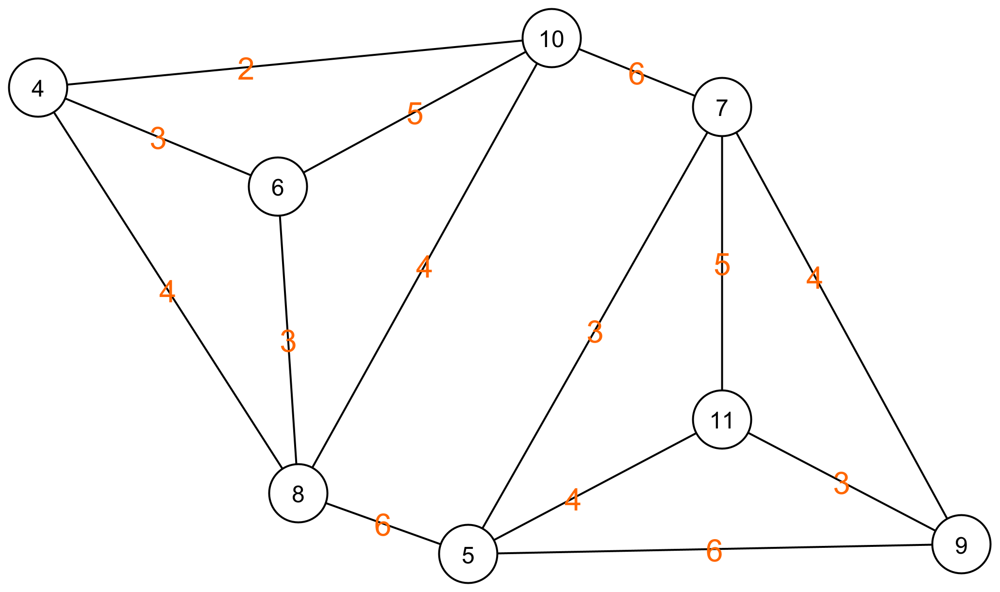 |
|  |  |
| We choose a random edge and the two nodes that are adjacent to that edge. | 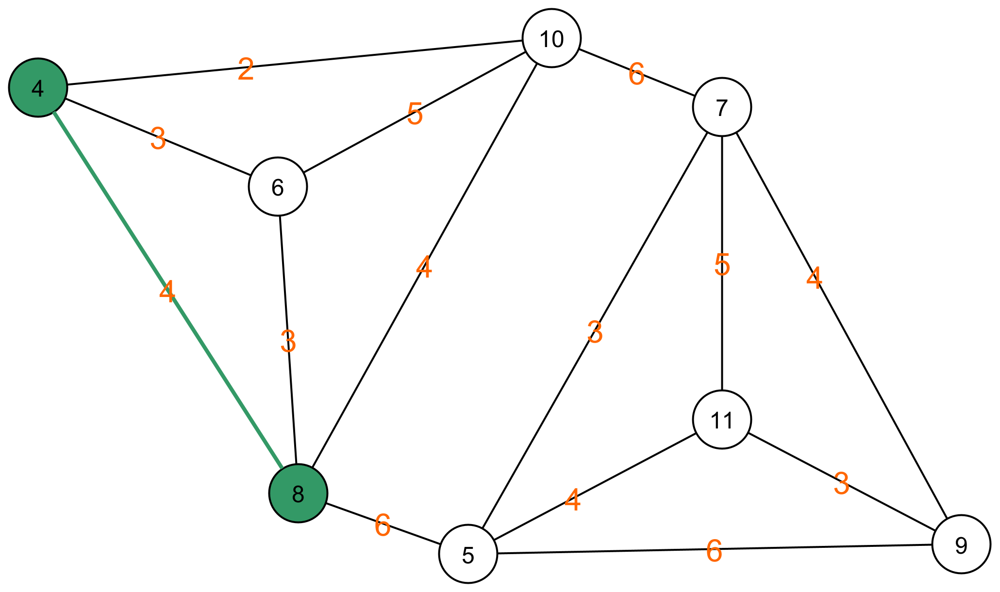 |
|  |  |
| We merge the two nodes by eliminating the edge that connects them. All other edges that originated from one of the two nodes now originate from the combined node. | 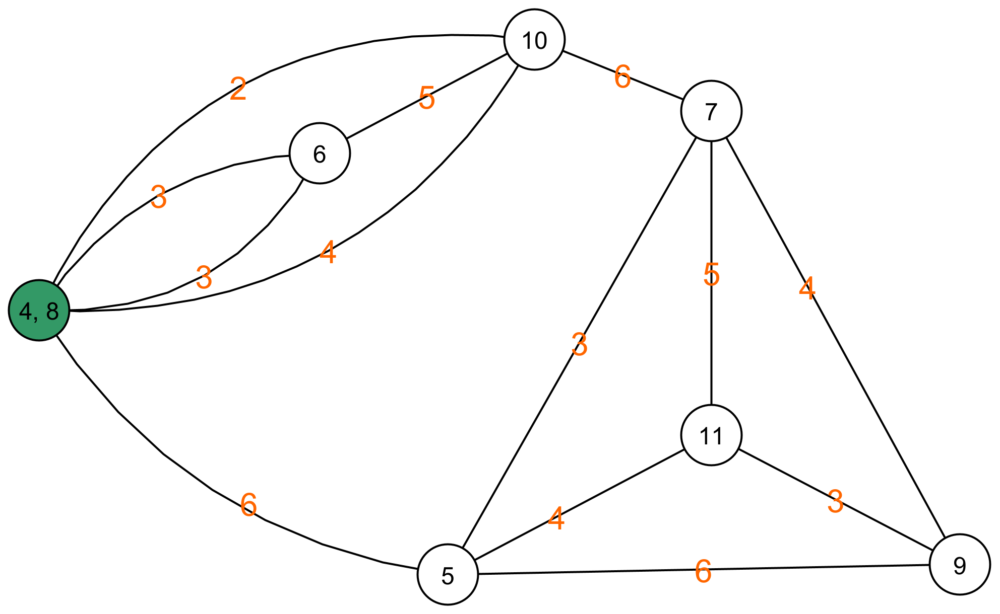 |
|  |  |
| If there are multiple edges running between the same nodes, we replace these edges with a single edge. The weight of this edge is equal to the sum of the weights of the edges we are replacing. For example, between node (4, 8) and node (6) there are two edges with weight 3. We replace these with one edge with weight 6. | 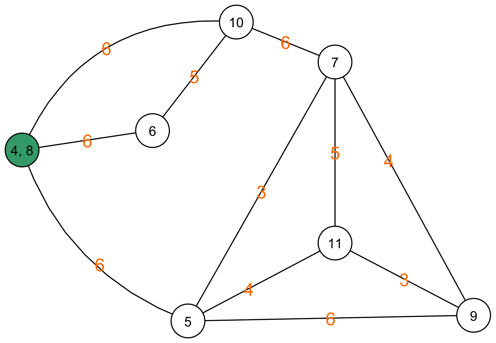 |
|  |  |
| Then we choose a random edge again. | 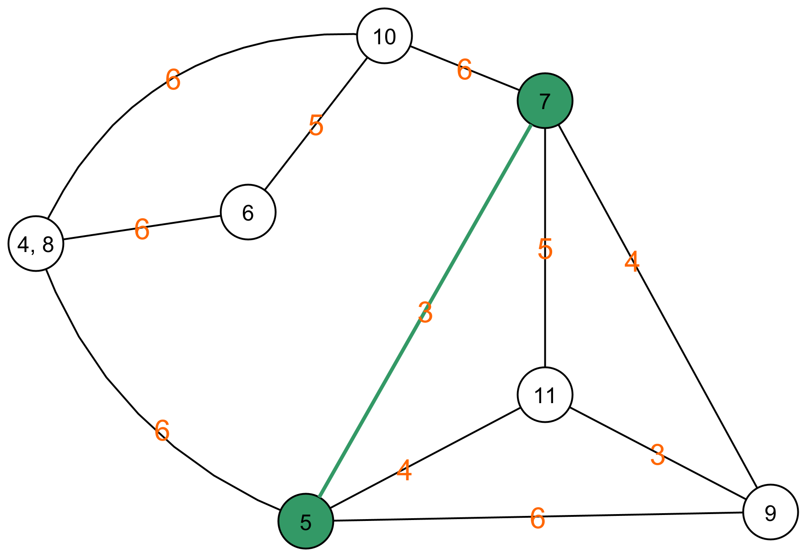 |
|  |  |
| We merge the adjacent nodes of this edge again. | 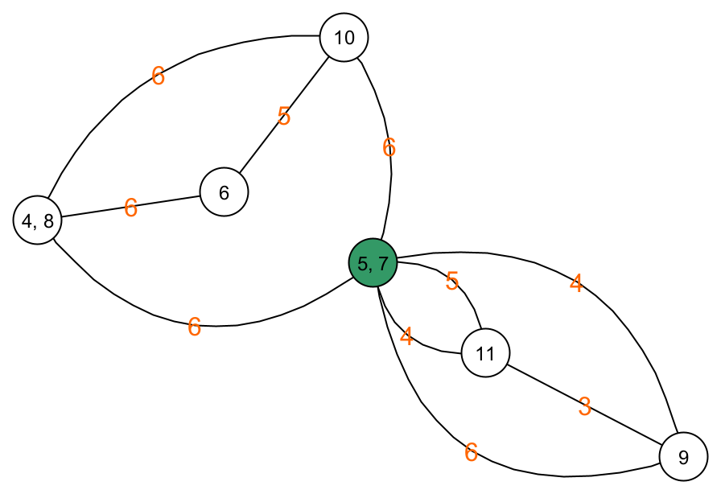 |
|  |  |
| And we again reduce double edges between the same two nodes. | 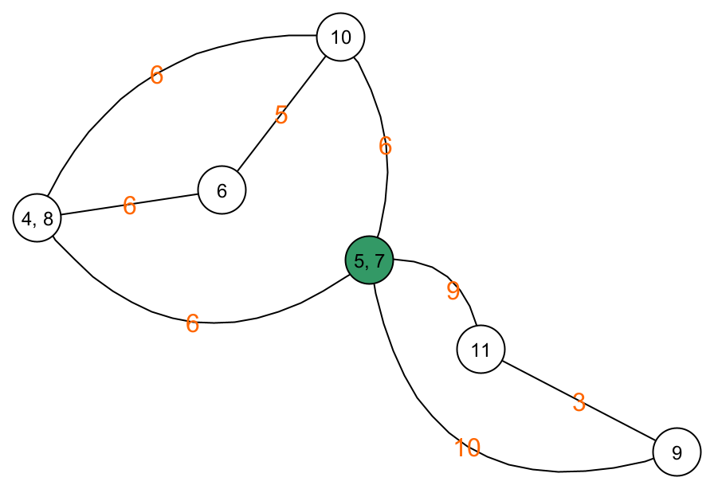 |
|  |  |
| We keep repeating this until only 2 nodes remain. Edge selection. | 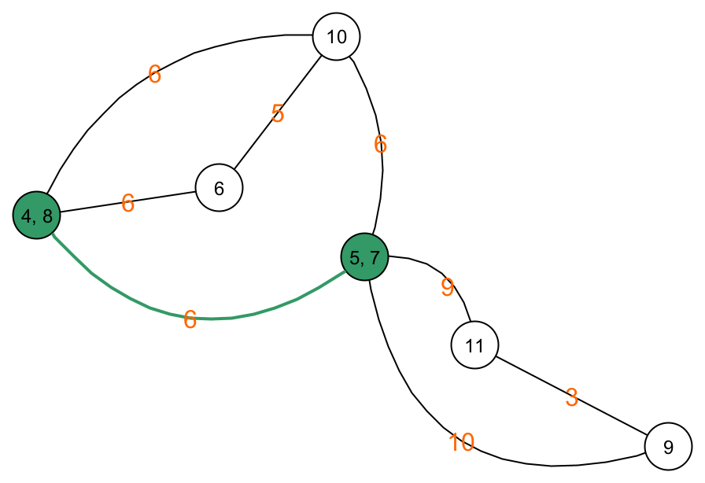 |
|  |  |
| Merging nodes. |  |
|  |  |
| Reducing edges. | 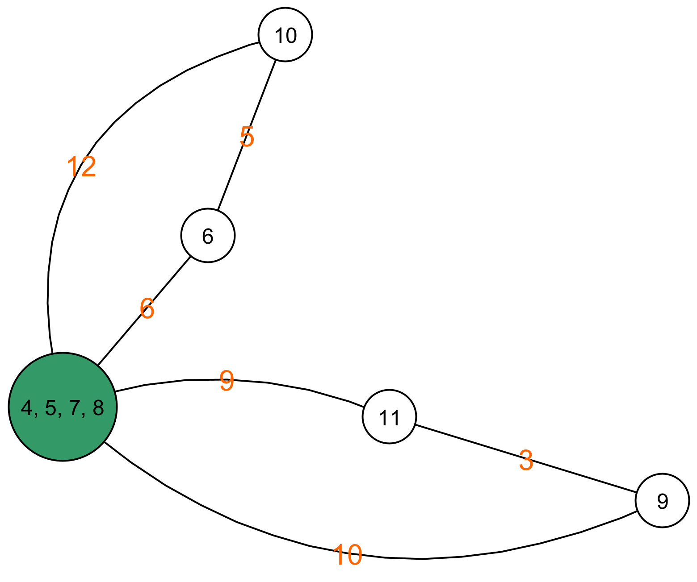 |
|  |  |
| Edge selection. | 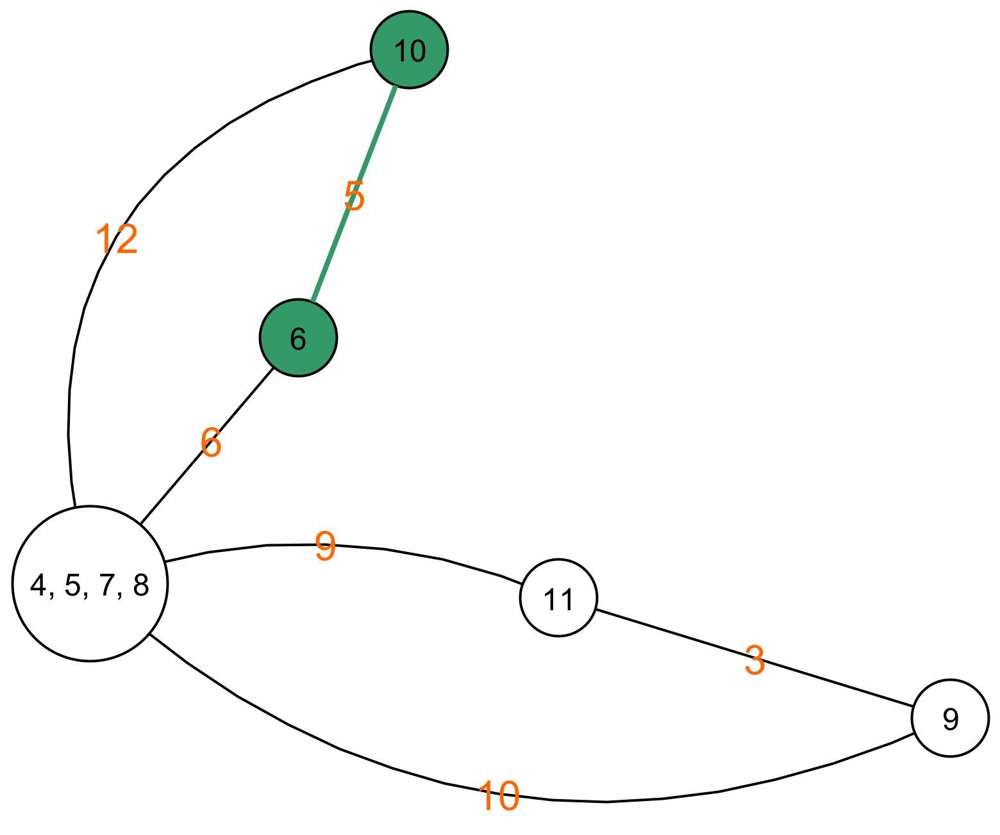 |
|  |  |
| Merging nodes and reducing edges. | 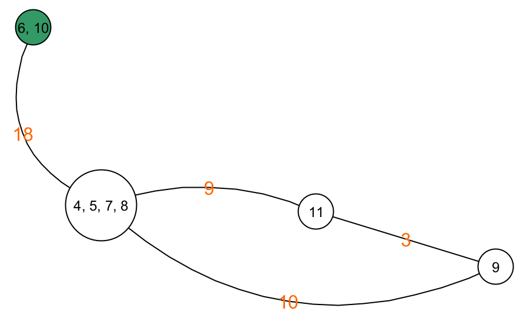 |
|  |  |
| Edge selection. | 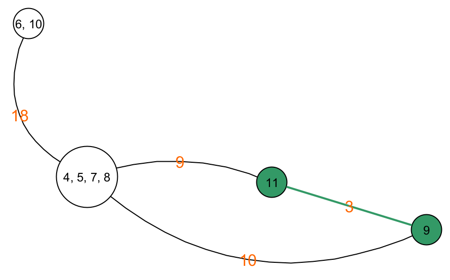 |
|  |  |
| Merging nodes and reducing edges. | 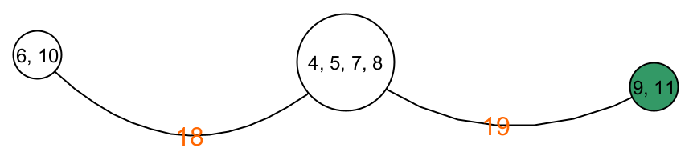 |
|  |  |
| Edge selection. | 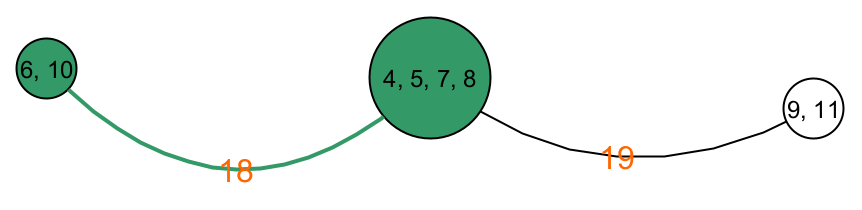 |
|  |  |
| Merging nodes and reducing edges. | 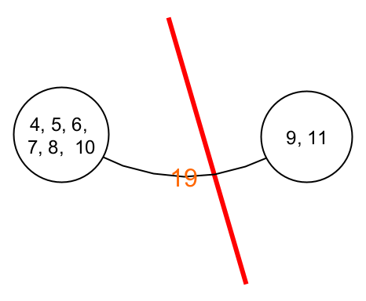 |

After this reduction, our guess for the minimum cut is the weight of the edge between the two remaining nodes. In this case, it's 22. **Note that this algorithm does not ensure that the distribution of nodes in the two parts of the cut is equal.** In our case, there are 6 nodes in one graph and two nodes in the other.