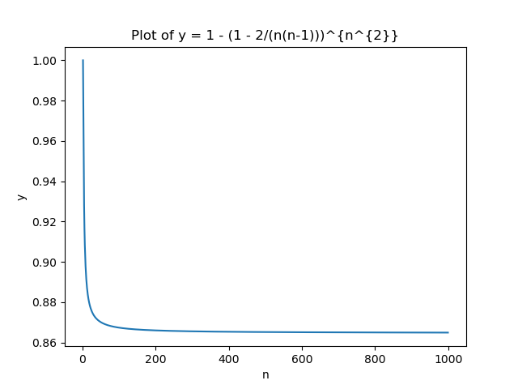

# Monte Carlo

## Karger's Algorithm: Theory

We now have a technique to guess what the minimum cut of the graph might be. The question is, of course, what the probability is that we guess correctly. If that probability is very small, we will have to guess a lot to come to a correct solution. The larger the probability of a correct guess, the fewer guesses we have to make. It can be proven that the probability of this guess being correct is equal to: \\[\dfrac{2}{n(n-1)}\\] So, if we guess \\(K\\) times, we will find the minimum cut with at least the following probability: \\[1-\left(1-\dfrac{2}{n(n-1)}\right)^K\\]

If we set the number of attempts to \\(n^2\\), then we can estimate the probability of finding a correct solution for large graphs by calculating the limit.

\\[\lim_{n \to +\infty}\left[1-\left(1-\dfrac{2}{n(n-1)}\right)^{n^2}\right] \approx 1 - \dfrac{1}{e} \approx 0.63\\]

If we plot the probability for \\(n\\) from \\(2\\) to \\(1000\\), we get the following graph. We see here that for all values of \\(n <= 1000\\), the probability that our algorithm finds the correct answer is greater than 86%.

To calculate the total algorithmic complexity, we can now calculate the number of attempts we have to make, in this case \\(n^2\\). We multiply this by the complexity of making a guess. For this, we must perform \\(n-2\\) reduction steps (the graph decreases by \\(1\\) node after each reduction step). In a reduction step itself, we need to reorganize at most \\(2(n-2)\\) edges (in the case of a complete graph). The cost of the reduction step is therefore \\(2(n-2)^2\\) or \\(O(n^2)\\). The total complexity of our algorithm is therefore \\(2n^2(n-2)^2\\) or \\(O(n^4)\\). Thus, we have a polynomial algorithm that comes to a correct solution with a high probability.