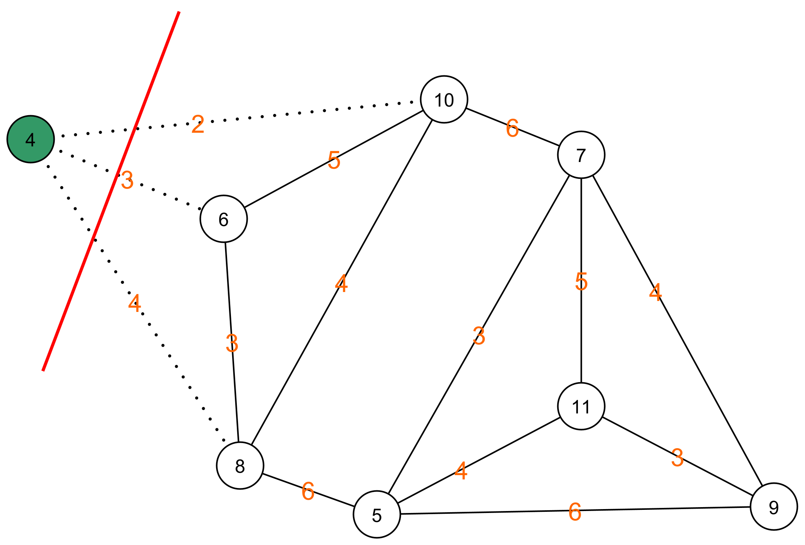

# Monte Carlo

## Karger's Algorithm: Remark

As previously indicated, this algorithm only looks for the minimum cut. It does not take into account an equal distribution between the nodes. Therefore, the algorithm suggests to cut away one node.



We can solve this by adding an extra condition to the selection of the minimum cut. 


```python

# Repeat guessing the cut cost n times and remember the best solution
def repeatGuessTheCutCost(edges_matrix, n=8):
    current_minimum_cut_cost = 100000 # Choose an arbitrarily large minimal cost to start with.
    labels_of_minimum_cut = []
    for i in range(n):
        mincutcost, labels = guessTheCutCost(edges_matrix.copy())
        # Only remember the solution if it is better than the current minimum and if the difference in the number of nodes in each of the parts is at most 1.
        if mincutcost < current_minimum_cut_cost and abs(len(labels[0]) - len(labels[1])) <= 1:
            current_minimum_cut_cost = mincutcost
            labels_of_minimum_cut = labels
    return current_minimum_cut_cost, labels_of_minimum_cut

```

In that case, we do get a correct solution:

The minimum cut is:  12
The labels of the nodes are:  [[0, 4, 6, 2], [1, 3, 7, 5]]

**Note that in this case, we can no longer prove that we will come to an acceptable solution within a reasonable amount of time!**