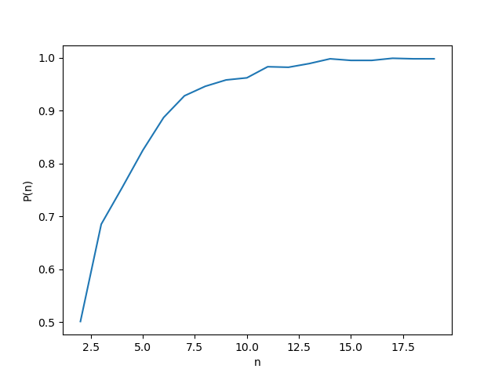

# Monte Carlo

## Karger's Algorithm: Probability of Correct Guess

Since we know the answer for our graph, we can calculate the probability of having a correct answer after \\(n\\) guesses.


```python

# Determine the probability of getting a correct answer using the minCutRepeat function for n = 8
def determineProbabilityOfCorrectAnswerForNumberOfGuesses(n):
    correct_count = 0
    for i in range(1000):
        mincutcost, labels = repeatGuessMinCutCost(edges_matrix, n)
        if mincutcost == 12:
            correct_count += 1
    return correct_count / 1000


probs = []
for tries in range(2, 20):
    probs.append(determineProbabilityOfCorrectAnswerForNumberOfGuesses(tries))
 
print(probs)
 
plt.plot(range(2, 20), probs)
plt.show()

```

The graph below shows the probability of a correct guess for each \\(n\\) from 2 to 20.

