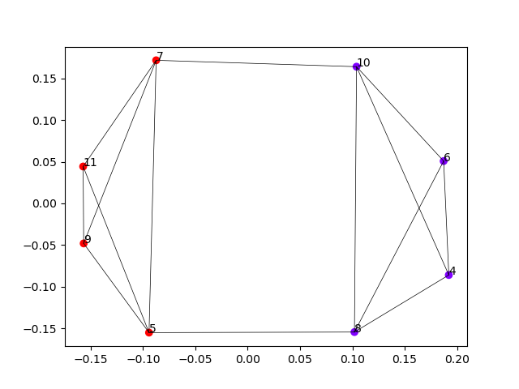

## Clustering

We have already seen two methods to solve the puzzle, each utilizing a different algorithmic technique. Here we are going to take a brief look at a third technique to solve the problem, which involves clustering. More information about clustering can be found in the [KIKS learning path](https://dwengo.org/learning-path.html?hruid=kiks3_dl_basis&language=nl&te=true&source_page=%2Fkiks%2F&source_title=%20KIKS#kiks_stomata;nl;3), where clustering is used to merge predictions that are close together.

Clustering algorithms are used to distinguish between groups of items based on their characteristics. [For example, differentiating apples and pears based on their height and width](https://dwengo.org/learning-path.html?hruid=ct6_cases&language=nl&te=true&source_page=%2Fcomputational_thinking%2F&source_title=%20Computationeel%20Denken#ct03_90;nl;3).

Here we use clustering to identify groups of nodes that are strongly connected. By cutting the connections between these strongly connected groups, we obtain a partition of the graph that is often a good approximation of the minimum cut.

In this case, we use spectral clustering. There are already several implementations in Python for this. We use the implementation from the sklearn library. This algorithm works on the edge matrix of our graph. So we can easily apply it with the following code.

```python

import numpy as np
from sklearn.cluster import SpectralClustering


edge_matrix = np.array([
    [0, 0, 3, 0, 4, 0, 2, 0],
    [0, 0, 0, 3, 6, 6, 0, 4],
    [0, 0, 0, 0, 3, 0, 5, 0],
    [0, 0, 0, 0, 0, 4, 6, 5],
    [0, 0, 0, 0, 0, 0, 4, 0],
    [0, 0, 0, 0, 0, 0, 0, 3],
    [0, 0, 0, 0, 0, 0, 0, 0],
    [0, 0, 0, 0, 0, 0, 0, 0]])


# Apply spectral clustering on the edge matrix
clustering = SpectralClustering(
    n_clusters=2,
    affinity="precomputed",
    assign_labels='discretize',
    random_state=0).fit(edge_matrix)
# Print the distribution of nodes.
print("The labels of the clusters are: ", clustering.labels_)

```

This code yields the following result.

The labels of the clusters are:  [0 1 0 1 0 1 0 1]

We see that this algorithm is also capable of finding the correct partition.

Spectral clustering makes use of the second smallest eigenvalue and eigenvector of the graph's Laplacian matrix. It is used to quickly divide the graph into two parts. If the second smallest eigenvalue of this matrix is small, then one usually gets a relatively good partition. If the second smallest eigenvalue is very large, then it is difficult to divide the graph into two parts, as there is not enough structure in the graph.

To visualize the partition, we can also make use of the SpectralEmbedding function in sklearn.

```python

# Perform spectral embedding
embedding = spectral_embedding(edge_matrix, n_components=2, eigen_solver='arpack')
# Plot the embedding
plt.scatter(embedding[:, 0], embedding[:, 1], c=clustering.labels_, cmap='rainbow')
# Plot labels and edges.
for x in range(len(embedding)):
    plt.annotate(x+4, (embedding[x, 0], embedding[x, 1]))
    for y in range(len(embedding)):
        if (edge_matrix[x][y] != 0 and x != y):
            plt.plot([embedding[x, 0], embedding[y, 0]], [embedding[x, 1], embedding[y, 1]], 'k-', lw=0.5)
plt.show()


```

Then we get the following figure.



**Note that the spectral embedding also succeeds in providing a nice representation of the graph!**