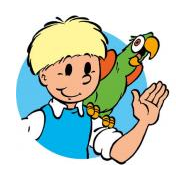
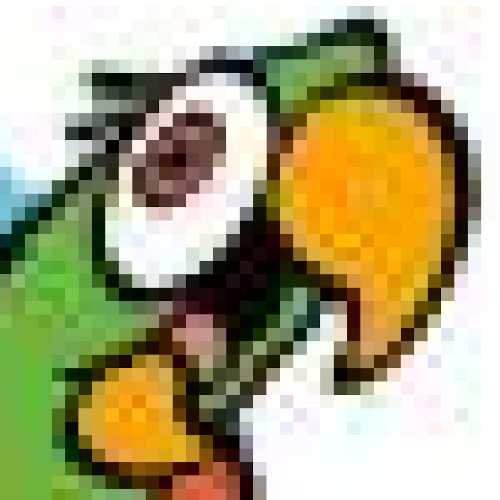

# Representing photos

A photo or digital image consists of a finite number of pixels. The word 'pixel' is derived from the English words *picture* (image) and *element*. The word 'digital' comes from the Latin *digitus* (finger) and refers to counting on the fingers. 

Look at the image of Jommeke. You can zoom in on a specific part of the photo. 

  
© Standaard Uitgeverij 2022

If you zoom in far enough, you can distinguish the individual pixels. 

 

To adjust the colors of an image, you therefore need to adjust the color of the pixels.

---
Images © Standaard Uitgeverij 2022 