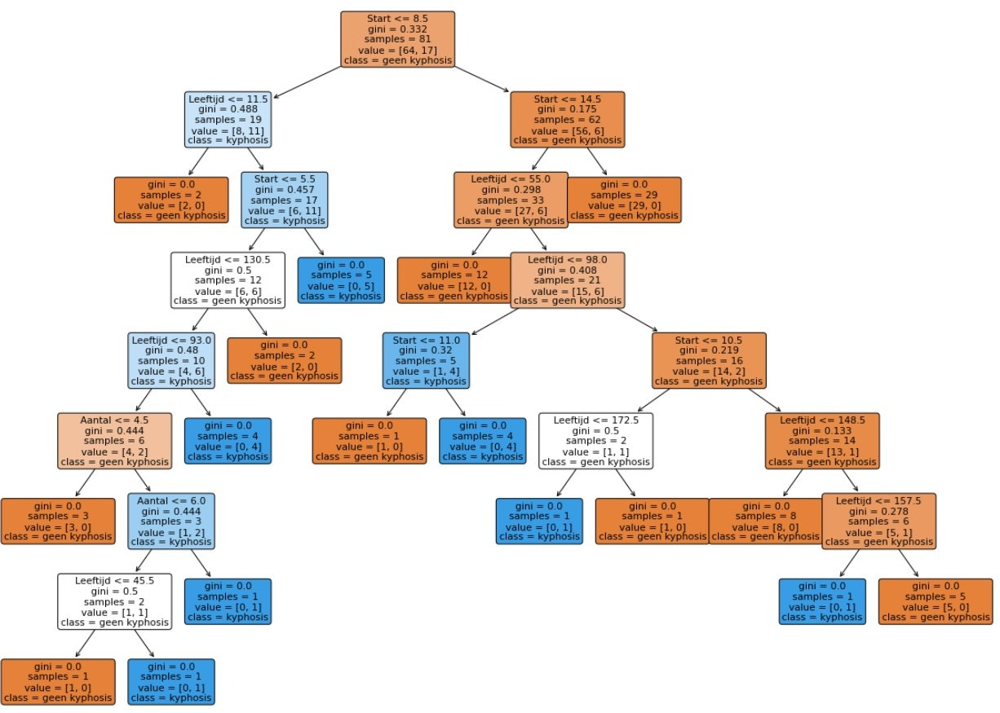

# Introduction
Artificial intelligence is increasingly finding its way into the healthcare sector. Logistics services in hospitals can benefit from artificial intelligence, electronic patient records can be better leveraged with it, and doctors use AI systems for intake interviews or to support making a diagnosis.

The following example illustrates how an artificially intelligent system can help a physician determine a therapy.
Kyphosis or ‘rounded back’ is a spinal disorder that manifests as an abnormal curvature of the upper back, as seen in Figure 1. 
Kyphosis can occur at any age but often appears in young adults. The patient can choose to undergo surgery, but the condition is often still present after the operation. The physician estimates in advance whether surgery is indicated or not and can be assisted by an AI system, for example a decision tree. 

The decision tree in Figure 2 ‘predicts’ whether a patient will be helped by surgery or not. This decision is based on various patient characteristics, namely the patient’s age in months, the number of vertebrae involved in the surgery, and the number of the first vertebra on which the operation is performed.  

These patient characteristics are entered into the AI system for a specific patient, and the system indicates to the physician whether surgery is appropriate for that patient.

Such a decision tree constitutes a rule-based AI system and is very transparent: it is clear how the system arrived at its decision. To construct the decision tree, a learning AI system was employed: the decision tree is based on labeled data, relevant patient characteristics linked to whether the surgery yielded results or not. In Chapter 1 of the manual you can read more about what terms such as rule-based, learning, and labeled mean.

In Chapter 4 you will see many more examples of decision trees from the healthcare sector.

------

**Challenge** 
Present labeled data from the healthcare sector in a way that is suitable for making decisions regarding a diagnosis or a treatment.
Let a computer help you with that.

------ 

For this learning path, have the manual or student course at hand.