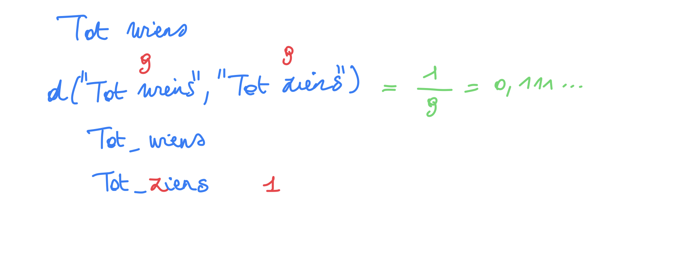
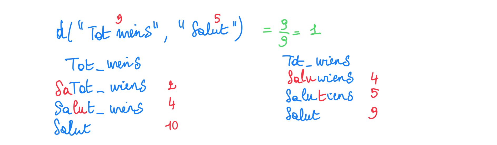

# Computational thinking

How can a chatbot link a posed question that is not in its 'dictionary' to a question that is in it and most closely resembles the posed question?  

Use numbers! An example: 

We look at how many characters need to be changed to transform one 'question' into another. The number of characters in the questions also plays a role.