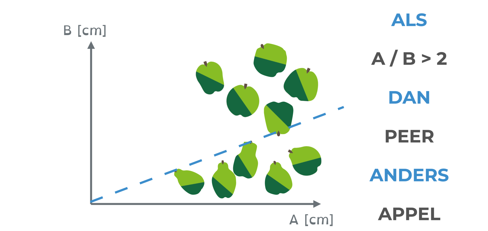

---

hruid: m_ct03_14
version: 3
language: en
title: "Apples and Pears"
description: "Apples and Pears"
keywords: [""]
educational_goals: [
    {source: Source, id: id},
    {source: Source2, id: id2}
]
copyright: dwengo
licence: dwengo
content_type: text/ct-schema
available: true
target_ages: [12, 13, 14]
difficulty: 3
return_value: {
    callback_url: callback-url-example,
    callback_schema: {
    att: test,
    att2: test2
    }
}
content_location: example-location
estimated_time: 1
skos_concepts: [
    '[http://ilearn.ilabt.imec.be/vocab/curr1/s-computers-en-systemen](http://ilearn.ilabt.imec.be/vocab/curr1/s-computers-en-systemen)'
]
teacher_exclusive: true
-----------------------

<context>
**Problem Statement** 

Problem: Create an algorithm to allow a computer to distinguish apples from pears using rules.

</context>
<decomposition>
**Decomposition** 
<ol>
    <li>How can a piece of fruit be presented to the computer (*representation*)?</li>
    <li>The computer must decide for a piece of fruit whether it is an apple or a pear (*classification*).</li>
</ol>
</decomposition>
<patternRecognition>
**Pattern Recognition** 
Presenting something to the computer always happens digitally, i.e., by using numbers. Images, sounds, and text are all converted into a digital form. 
Classifying objects occurs in many contexts. In these different contexts, similar solutions are often applied, such as deep neural networks (an artificial intelligence technique for this purpose). Recognizing that a known solution is also applicable in a new context is pattern recognition.
</patternRecognition>
<abstraction>
**Abstraction** 

How do we present apples and pears to the computer? Digital photos are actually grids of numbers. A color photo, for example, is represented using RGB encoding: the representation consists of 3 tables of numbers, one for the red, one for the green, and one for the blue channels; each triplet (R,G,B) corresponds to one pixel. 
Based on the values of these numbers, the computer can, for example, detect the edge of the piece of fruit.
</abstraction>
<algorithms>
**Algorithmic Thinking** 
If you work with three-dimensional representations of the pieces of fruit, e.g., using 3D scans, the dimensions of the fruit can be determined: the circumference A 2 cm from the bottom and the circumference B 2 cm from the top. 

Based on these two numbers, you can create an **algorithm** that allows a computer to distinguish apples and pears.

</algorithms>
<implementation>
**Program** 
No implementation. In this example, no programming is done.
</implementation>
