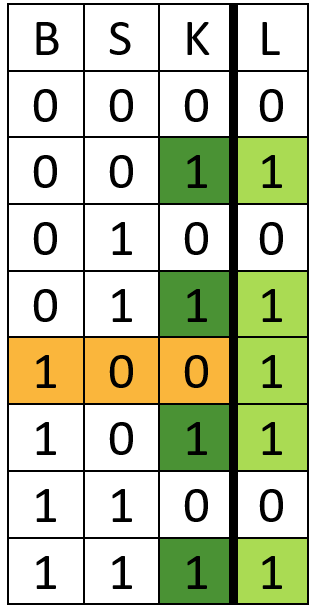
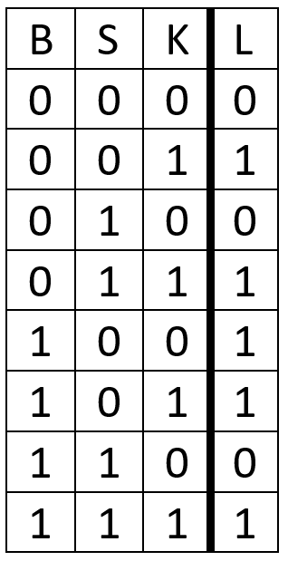
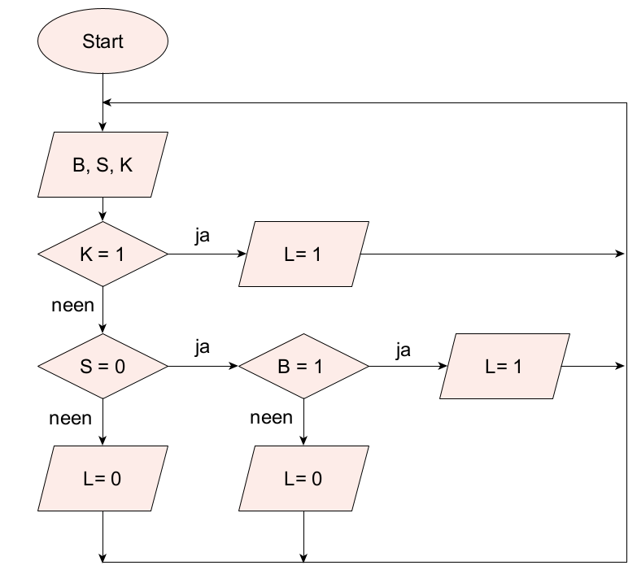

---

hruid: m_ct03_34
version: 3
language: en
title: "Patio Lamp"
description: "Automatic patio lighting"
keywords: [""]
educational_goals: [
    {source: Source, id: id},
    {source: Source2, id: id2}
]
copyright: dwengo
licence: dwengo
content_type: text/ct-schema
available: true
target_ages: [12, 13, 14]
difficulty: 3
return_value: {
    callback_url: callback-url-example,
    callback_schema: {
    att: test,
    att2: test2
    }
}
content_location: example-location
estimated_time: 1
skos_concepts: [
    '[http://ilearn.ilabt.imec.be/vocab/curr1/s-computers-en-systemen](http://ilearn.ilabt.imec.be/vocab/curr1/s-computers-en-systemen)'
]
teacher_exclusive: true
-----------------------

<context>
**Problem Statement** 
Ensure that the patio lighting at a villa is automatically activated when it is dark outside and motion is detected, and that the outdoor lighting can also be switched on via a switch in the kitchen.  
</context>
<decomposition>
**Decomposition** 
<ul>
    <li>Explore the problem. What do you need?
    <li>Subtasks:
        <ul>
            <li>Which input elements?</li>
                <ul> <li>Motion detector B (motion: B = 1)</li>
                    <li>Light sensor S (dark: S = 0)</li>
                    <li>Switch K (pressed: K = 1)</li>
                </ul>
            <li>Which output elements?</li>
                <ul>
                    <li>Light L (on: L = 1)</li>
                </ul>
        </ul>
    </li>
    <li>Represent the requirement using a truth table.</li>
    <li>Create an algorithm to control the lighting.</li>
</ul>
</decomposition>
<patternRecognition>
**Pattern Recognition** 
<ul>
    <li>Similar problems follow a standard approach: creating a truth table and an algorithm.</li>
    <li>Look for patterns in the truth table, e.g. 
</ul>

   
Check when the lamp is on (highlighted in light green). 
If K = 1 (dark green) the lamp will turn on (L = 1), regardless of B and S. 
For K = 0, there is only one case when the lamp is on: S = 0 and B = 1 (orange).</li>

</patternRecognition>
<abstraction>
**Abstraction** 
<ul>
    <li>The problem is represented abstractly using a truth table. The inputs are in the first three columns, the output in the last column.</li>
</ul>

  </abstraction> <algorithms>
**Algorithmic Thinking** 

<ul>
    <li>The solution involves controlling the lighting system using an algorithm (here represented via pseudocode or a flowchart). 
</ul>

 
  
 
 </algorithms> <implementation>
**Program** 
No programming is required for this activity. </implementation>
