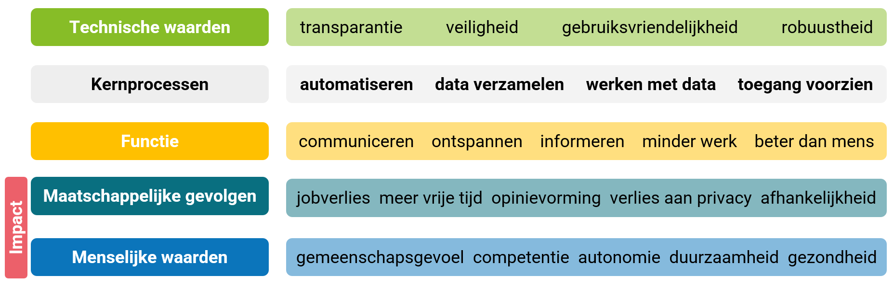

# Mediawijs minimum objective 

For the second grade, a minimum objective has been formulated that aims for students to learn to assess the impact that digital systems have; using the principles of computational thinking as a guideline, they reflect on the operation of these systems.

-----

(04.05 Finality flow-through; Dual finality, Labour market finality) Students analyse the impact of digital systems on society from the principles of computational thinking.

&nbsp;&nbsp;&nbsp;&nbsp;Memory: 
&nbsp;&nbsp;&nbsp;&nbsp;Principles of computational thinking such as decomposition, pattern recognition, abstraction, and algorithms. 
&nbsp;&nbsp;&nbsp;&nbsp;The impact of digital systems on society from principles of computational thinking such as the algorithms that digital platforms use when

- selecting and presenting information to users;
- collecting personal information from users and (mis)using it for their own purposes;
- influencing users’ choices (e.g. personalised offers, personalised advertising);
- influencing users’ worldview/opinions;
- making decisions about users (e.g. about credit applications, job applications, insurance);
- creating language interaction using artificial intelligence (chatbot);
- creating art (images, music, poetry, other art forms) using artificial intelligence;
- medical imaging to report possible abnormalities to doctors based on an initial scan.
  Source: [AHOVOKS.Starting points for the educational goals](https://onderwijsdoelen.be/uitgangspunten/6185)

---

In the learning path ['Cases'](https://www.dwengo.org/en/learning-path.html?hruid=ct6_cases&language=en&te=true&source_page=%2Fen%2Fcomputational_thinking%2F&source_title=%20Computational%20Thinking#ct03_00;en;3) we proposed a framework with which teachers can prepare their lessons in the context of computational thinking. In that learning path, you already became extensively familiar with its concrete implementation. Here too, this framework will be useful.
In addition, the following framework is sometimes used to clarify the impact on society.

 Source: Michael T. Rücker. 2023. Modeling Conceptual Knowledge of Computing Impacts for K-12.

As a result, each learning object within this path has the same structure:

1. Description of the problem.
2. Completion of the framework with principles of computational thinking.
3. (Optional) mind map/visualisation of a possible brainstorm.
4. (Optional) framework *impact on society*.
5. Discussion of the impact.
6. Related examples.

