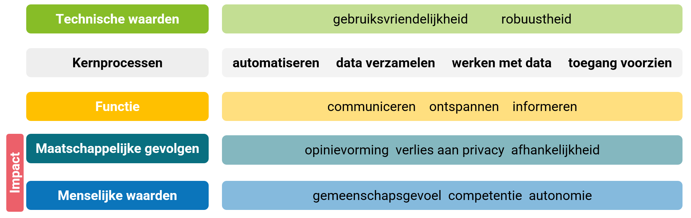

# Profiling via social media

Social media platforms create personality profiles of their users. 
Such a profile can, e.g., contain a person's interests, opinions, character, and preferences. 
The use of a personality profile can impact platform users in multiple ways. Personalized advertising is one example. 

**Impact: personalized advertising** 
Companies study social media posts to get an idea of someone's personality. They then try, using that information, to persuade the user to make a particular purchase. It is a way to personalize advertising. In this way, services and products are recommended based on recommendation algorithms. Recommendation algorithms can strongly influence online shopping behavior (e-commerce). 

## Principles of computational thinking

## Framework: impact on society

## Discussion of the impact

- **Capacity for large data storage**: Posts on social media are carefully retained by the platform in question and permanently linked to the user. In addition to social media posts, purchase and click behavior are also stored.

 - **Patterns**: Both the social media posts and the purchase and click behavior of a user are used to create a personal profile of that person. Recommendation algorithms make recommendations that are, for example, based on certain **patterns** present in the user's click and purchase behavior. The experience on the social media platform is also personalized based on the purchase and click behavior of **users with ‘related’ interests**. 
From someone's social media posts, one can infer the author's interests and opinions, and perhaps even the person's character and preferences. Language use is related to this. 

> Personality can be viewed according to the Five Factor Model, in which the traits ‘extraverted’, ‘agreeable’, ‘conscientious’, ‘neurotic’ and ‘open to experience’ are considered (Schwartz et al., 2013). Language use is related to gender, age, and personality traits such as being introverted or extraverted (Schwartz et al., 2013; De Gussem & Daelemans, 2020). For instance, some words and phrases are more typical of certain age groups, such as ‘homework’ for teenagers and ‘family and friends’ for adults, and there are specific topics people write about on Facebook, such as ‘family’ for women and ‘xbox’ for men. Extraverted people use longer words than introverted people, and many adjectives.
Schwartz et al. illustrate this with several word clouds they compiled based on Facebook posts they analyzed (see Figure 1 for teenagers). Schwartz et al. used a dataset of 15 million Facebook posts from 75,000 volunteers. The cluster in the middle contains the words that are characteristic of the group: the larger the word, the more characteristic; the darker the word, the more frequent. The surrounding clusters show the characteristic topics of Facebook posts.
>  
> 
Figure 1: Most characteristic words and topics for teenagers on Facebook (Schwartz et al., 2013).

 - **Algorithms:** With natural language processing (NLP), that is, by processing natural language, one examines texts on social media to determine whether people express themselves positively or negatively about certain products or companies. Recommendation algorithms result in users receiving personalized advertising. 

#### Sources
De Gussem, J. & Daelemans, W. (2020). Are you what you write? *EOS Psyche & Brain Special*, (pp. 40–43). 
Schwartz, H., Eichstaedt, J., Kern, M., Dziurzynski, L., Ramones, S., Agrawal, M., Shah, A., Kosinski, M., Stillwell, D., Seligman, M., & Ungar, L. (2013). Personality, Gender,
and Age in the Language of Social Media: The Open-Vocabulary Approach. *PLOS ONE, 8*(9).