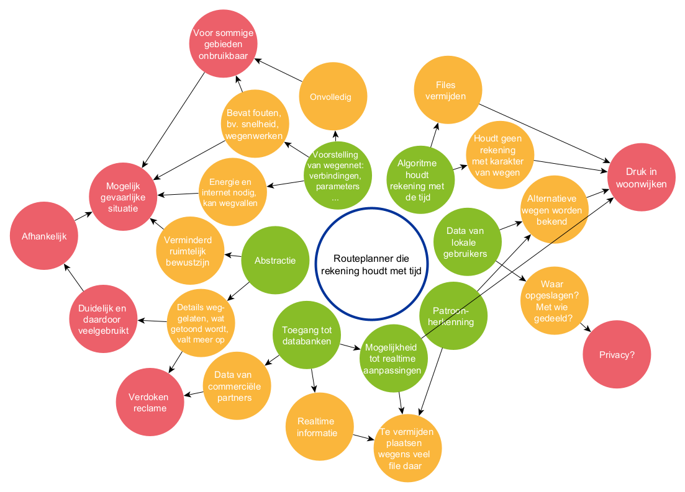

# Route planner

Route planners are a widely used digital application. They impact our society in multiple ways.
Here's an example.

**Impact: more traffic in residential neighborhoods** 
Many people use a navigation system in the car, for example to quickly drive somewhere they've never been before, or to avoid traffic jams.

In the media you can find numerous reports attributing increasing traffic in residential neighborhoods to the widespread use of navigation systems.

> **Reading tips:** 
> [Navigation app Waze fills Brussels residential streets](https://www.bruzz.be/analyse/navigatieapp-waze-laat-brusselse-woonstraten-vollopen-2019-09-18) 
> [Waze Asked to Stop Providing Drivers With Traffic Shortcuts Because of Obvious Reasons](https://www.autoevolution.com/news/waze-asked-to-stop-providing-drivers-with-traffic-shortcuts-because-of-obvious-reasons-215490.html)

## Principles of computational thinking

## Visualization of a possible brainstorm in class

## Framework for impact on society
(based on the model by Michael T. Rücker. 2023. Modeling Conceptual Knowledge of Computing Impacts for K-12.)

## Discussion of the impact

- One of the reasons that route planners are used so much and therefore have the potential to have an impact is the high degree of abstraction in the route planner. If desired, you can simply follow the instructions for the road you need to take (the step-by-step plan). You don't have to bother with looking up the route on a map, where you would have to take into account, for example, one-way streets, the orientation of the map, etc.   In addition, it provides additional information such as traffic jams, roadworks, where you can refuel, etc.   Such a route planner is therefore very user-friendly.
    - The route planner is so ingrained that people often don't realize that using it isn't always the best way to find your way. Sometimes it's impossible to use a route planner anyway, for example if there's no internet coverage or if your smartphone battery is dead.
    - Because so much is abstracted in route planners, you no longer have a complete view of the surroundings. That can also be a disadvantage compared to a paper map, which gives many more details of the environment and moreover places a location within a larger area. Route planners, as it were, erode the spatial awareness around a place. 
    - Being too dependent on digital route planners can also be dangerous. Some places are insufficiently detailed or inaccurate, causing people, e.g., to drive onto a railway track or a staircase, end up in the middle of roadworks, or drive the wrong way. Digital route planners can also contain errors, such as an incorrect maximum speed allowed on a given road or a one-way street indicated as two-way.
      > [Police Heusden-Zolder warns against using GPS during roadworks](https://www.vrt.be/vrtnws/nl/2021/09/23/politie-heusden-zolder-waarschuwt-voor-gebruik-van-gps-bij-wegen/)

- The use of a route planner by so many people can also have undesirable effects, such as extra traffic in residential neighborhoods when a route planner diverts car traffic through residential areas to avoid traffic jams.
    - It may be that the route planner's algorithm takes the aspect of the environment 'in a residential neighborhood' into account, but that aspect may not be included as a parameter in the algorithm. For example, to determine the shortest route the route planner mainly needs to take the distance parameter into account; other parameters, such as the fact that a street is in a residential area, may then be ignored.
    - The digital system behind the route planner can detect certain patterns, such as a route that is usually only known to local residents and commonly used by them. If the system adds that route as a possible path, the route will also become known to non-local drivers and may thus increase congestion in a residential neighborhood.

- Ethical aspects:
    - Route planners use algorithms that calculate the route, often taking into account real-time information, such as traffic jams, which they then try to avoid. Real-time traffic information can come from multiple sources, for example the police or a highway operator. But the system can also obtain information via the current users of the route planner. This involves the aspect of privacy. 
        - Is the user's location stored?
        - If users' locations are stored, the question arises what the company behind the route planner does with that data.
    - Route planners also provide advertising. 
        - For example, it is determined which stores, gas stations, etc. are shown.
        - A tourist can, for instance, use the route planner to find out which businesses are near the hotel.
        - There may be agreements with commercial partners to have them present along routes as much as possible.
        - To that end, the route planner has access to databases of restaurants, stores, cinemas, etc. These are different databases from those strictly necessary to make the route planner work. 
    - Route planners can also take into account things you might not expect.
      > [Mercedes navigation avoids criminal neighborhoods](https://www.ad.nl/auto/navigatie-mercedes-ontwijkt-criminele-buurten~a48a4169/) 