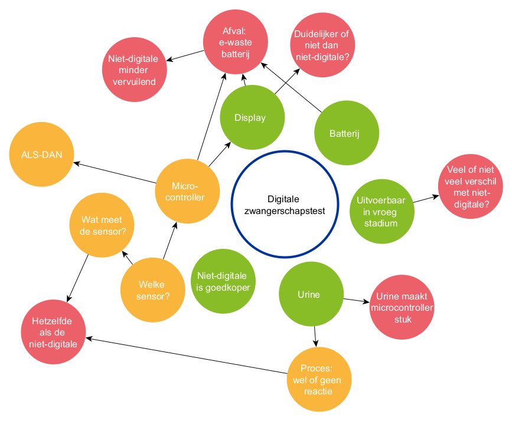

# Pregnancy test

On the market, pregnancy tests can be found in both non-digital and digital forms. Manufacturers of pregnancy tests may count on people assuming that a digital version of the pregnancy test is better than a non-digital version. By offering a digital version, they may increase their profit margin, because that digital version is considerably more expensive than the non-digital pregnancy test. 

**Impact: pregnancy test** 
One possible impact is that people spend more money than necessary.

But to be able to decide that, it's best to compare how both systems work to determine whether one has more advantages or disadvantages than the other. 

## Principles of computational thinking

## Framework: impact on society

## Discussion of the impact

- Because of the electronics that the digital device contains, it is less robust and consequently also less easy to use. You must ensure that no moisture reaches the microcontroller, otherwise the device will break.
- Because of the text on the display, on the one hand it is more suitable for people who struggle with abstraction (interpreting 'one line' versus 'two lines'), but on the other hand it is less suitable for people who cannot read well or do not understand the language of a particular region.
- The fact that you can do such a test yourself, without consulting a doctor, makes it accessible to people who do not wish or dare to go to a doctor. The test therefore provides independence and more privacy and has the potential to get certain information to more people.
- The human values associated with this are autonomy and health. But this equally applies to the non-digital version of the test.
- Due to the e-waste and the battery that the digital version leaves behind, it has an additional impact on the environment and is therefore less sustainable than the non-digital version.