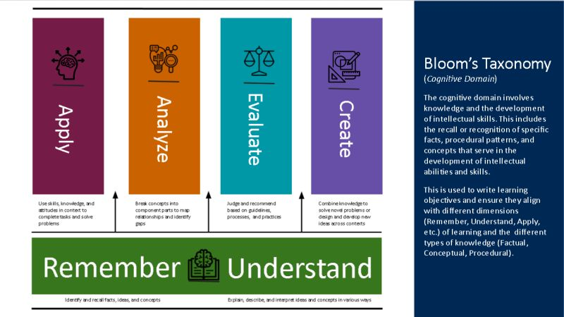
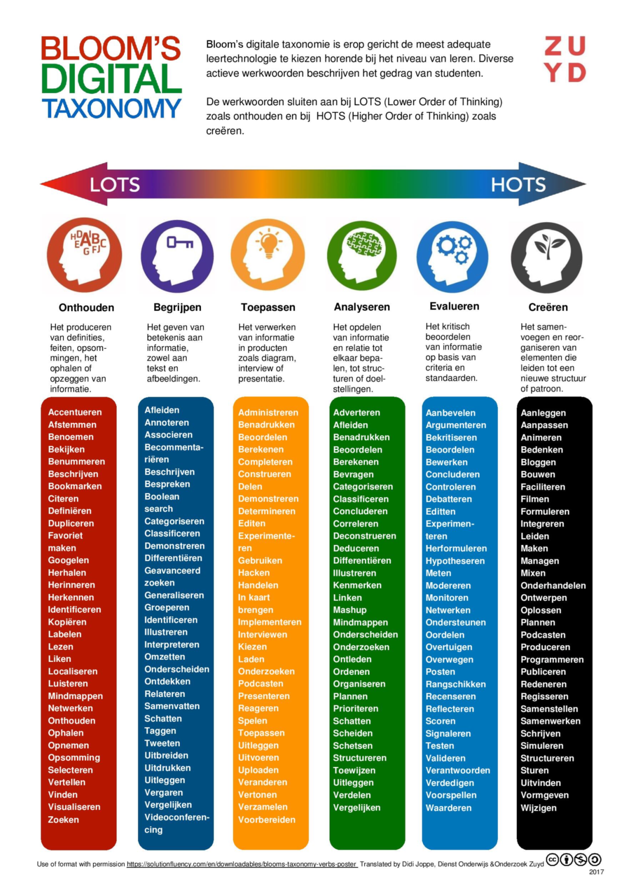
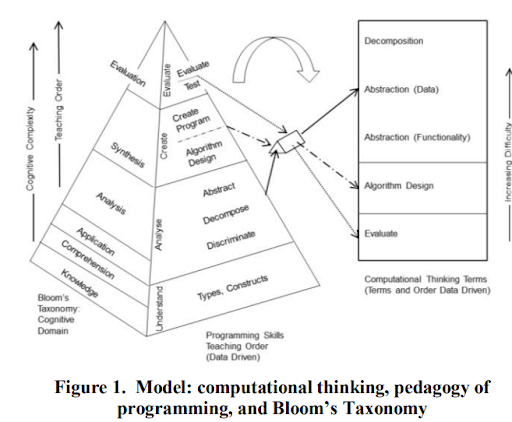

# Action verb

Each attainment target and each minimum objective are formulated by means of an action verb. It provides an indication of the level of mastery at which students should be assessed. However, the action verbs do not imply a strict hierarchy.  

## Action verbs for digital competencies

The revised Bloom's taxonomy describes six categories of ‘learning’: remember, understand, apply, analyze, evaluate, and create. The taxonomy can provide a foothold when assessing students. 

> In the annulled attainment targets, the level of mastery was indicated by means of the revised Bloom's taxonomy. In the current minimum objectives, the taxonomy was abandoned, but the action verbs have remained. 
For more information on the revised Bloom's taxonomy, see ‘A taxonomy for learning, teaching, and assessing: A revision of Bloom’s taxonomy of educational objectives’ by Anderson and Krathwohl (2001).

 
Revised Bloom's taxonomy; this does not imply a hierarchy. [1]

Another representation: 
 
DrAntonT, CC BY-SA 4.0, via Wikimedia Commons.

Misconception: The categories of Bloom's taxonomy imply a hierarchy. 
*This misconception is reinforced in part because they are often presented in a pyramid/triangle.*

To determine the category of a learning objective, specifically for digital competencies, you can use one of the action verbs collected in the following image. You can also use them to determine the level of mastery for an assessment. 
 
Verbs within the framework of Bloom's taxonomy, suitable for use in a digital context. [2]

## Computational thinking

### Programming

Cynthia Selby (2015) linked the six categories of ‘learning’—remember, understand, apply, analyze, evaluate, and create—to five core concepts of computational thinking, namely decomposition, abstraction, algorithm, generalization, and evaluation.  
She also investigated how difficult teachers perceive certain concepts of computational thinking within a programming context. 
> Decomposition is experienced as the most difficult.  
In a programming task, decomposition is the first thing one does. The fact that this is experienced as very difficult should be taken into account from a pedagogical point of view.

The mapping and the results of that study are presented in the following figure. 
 
Model for computational thinking, didactics of programming, and Bloom's taxonomy (Selby, 2015). We do not agree with the
indicated order of complexity and the sequence in which certain items are addressed in class; the rest is valuable.

Ramon-Gonzalez et al. indicate that assessing computational thinking is not possible with a single assessment format. On the contrary, you need to use different assessment formats that complement each other. 

 
Bloom’s taxonomy and CT assessment tools. [3]

### Unplugged activities

In addition to programming, the ‘CS Unplugged’ activities have also been mapped onto Bloom's framework. Bell & Vahrenhold (2018) concluded that unplugged activities alone are not sufficient to cover all categories of the framework.