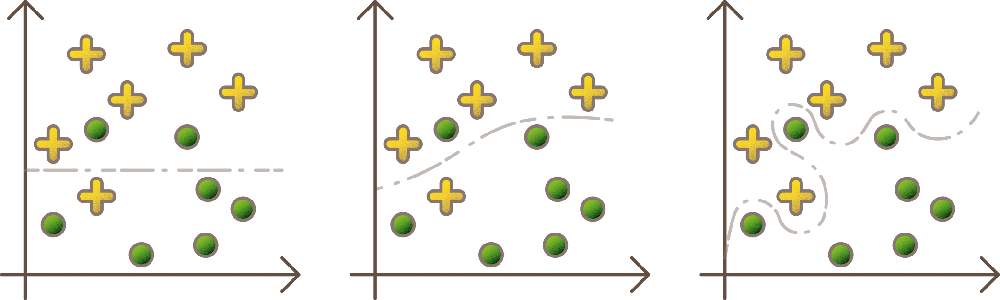

# Overfitting
When a network becomes too fixated on the training data, it will perform worse on unseen data. The network then essentially memorizes the training data by heart. This is called **overfitting**. When the network is still able to learn, by adding more layers for example, it is referred to as **underfitting**.

 

On the left of the image, there is a case of underfitting, while the right graph illustrates overfitting.

In the following notebook, you will learn how to take this into account.

